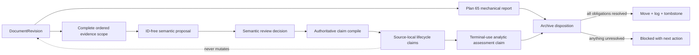
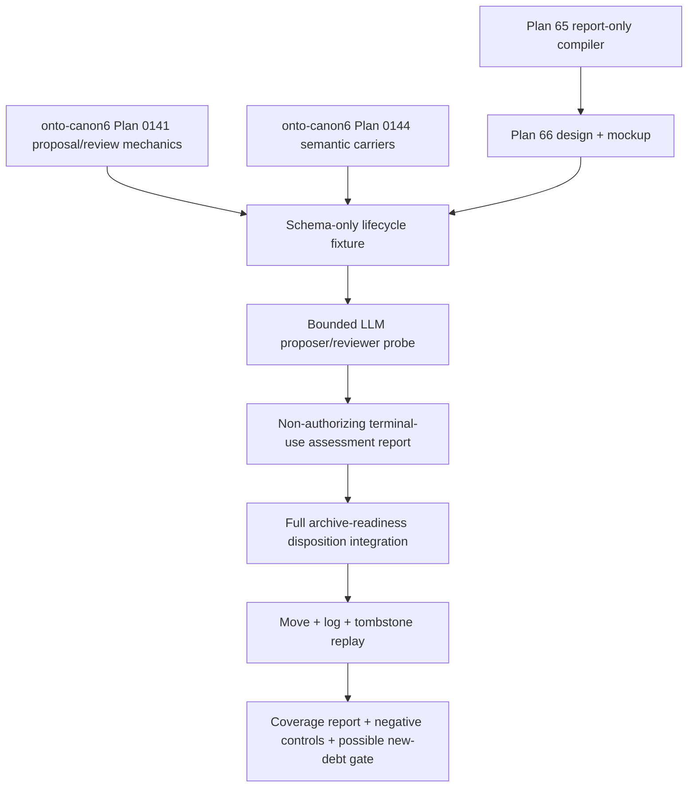

# Plan #66: Evidence-Bound Semantic Document Lifecycle Assessment

**Status:** Design complete; awaiting human mockup disposition; no implementation authority
**Type:** design
**Priority:** High
**phase_ref:** "Document lifecycle P3 design"
**goal_ref:** "relationship-lifecycle-semantic-review"
**adrs_referenced:** ["ADR-2026-07-14-document-lifecycle-and-archive-disposition", "Greer ADR 005", "Greer ADR 007", "Greer ADR 008", "Greer ADR 010"]
**research_citations:** []
**Blocked By:** None
**Blocks:** [future] reviewed archive-readiness and tombstone integration

---

## Mission And Current Gate

Design the smallest provenance-preserving seam by which an LLM or human can
interpret a document's lifecycle meaning without regex classification,
destructive rewriting, or converting the interpretation into an archive
authorization.

This design increment is complete only when:

1. the document's source claims, the analyst's lifecycle assessment, and the
   repository's archive disposition are represented as different records;
2. a concrete Greer V8-B1 mockup makes the separation reviewable;
3. proposal, review, claim, and disposition authority remain separate;
4. the design reuses onto-canon6 semantic-authoring mechanics instead of
   creating a second semantic system in enforced-planning; and
5. implementation remains blocked until Brian accepts or revises the concrete
   mockup.

## Gap

**Current:** Plan 65 inventories narrative Markdown and reports mechanical
archive blockers. It deliberately recognizes only a narrowly formatted
source-local `Status` field and otherwise returns lifecycle `unknown`. For the
Greer V8-B1 document it reports both `document-undeclared` and
`lifecycle-not-terminal`, even though the document contains an explicit prose
note saying it was superseded before implementation. Plan 65 cannot and must
not decide what that prose means.

**Target:** A model or human proposes standalone, evidence-bound source-local
claims after receiving the complete document. A separate reviewer accepts,
rejects, withholds, or preserves ambiguity at the exact source revision. A
separate corpus/governance assessment may then claim that the document is
terminal for active use. The archive workflow consumes that assessment plus
Plan 65's mechanical report, but cannot authorize a move while any independent
blocker or semantic obligation remains.

**Why:** A document may simultaneously contain historical tasks, explicit
supersession language, current evidence, copied status text, unresolved claims,
and a named successor. Neither a regex nor a single `status` scalar can safely
represent those meanings. Treating a model's answer as a disposition would
collapse evidence, interpretation, and operational authority.

## References Reviewed

The relevant research, current contracts, implementation seam, and difficult
fixture were enumerated before this synthesis. No adjacent-agent summary was
used as authority over these files.

### Enforced-planning and policy

- `CLAUDE.md` — continuous-execution and isolated-worktree requirements.
- `docs/plans/CLAUDE.md` — current plan queue; deliberately not modified while
  Plan 64 owns plan-governance work.
- `docs/plans/65_document_archive_lifecycle_report.md` — accepted P2 boundary
  and evidence grades.
- `docs/designs/RELATIONSHIP_CONTEXT_CONTRACT.md` — current relationship and
  report-only lifecycle contract.
- `enforced_planning/archive_lifecycle.py` — current exact status extraction,
  candidate blockers, and `semantic_review_required` ceiling.
- `project-meta` commit `4985ba650d033cf8737902e7d54ba0a176e5e4ce`,
  `docs/ops/ADR-2026-07-14-document-lifecycle-and-archive-disposition.md` —
  accepted lifecycle policy and archive-eligibility conditions.

### Greer semantic architecture and research

- `greer/docs/adr/001-greer-governed-mapping-boundary.md` through
  `greer/docs/adr/011-legacy-analysis-as-versioned-source-evidence.md` — the
  complete current ADR series was read; ADRs 005, 007, 008, and 010 directly
  determine this seam.
- `greer/docs/architecture/layered-semantic-graph.md` — evidence,
  source-local, corpus-analytic, and projection layers.
- `greer/investigations/2026-07-13-cross-document-ambiguity-resolution-osint.md`
  — ambiguity cases, alternatives, evidence relations, qualitative assessment,
  and LLM/program responsibility boundary.
- `greer/investigations/2026-07-13-blind-annotation-feasibility-protocol.md` —
  independent submissions, non-destructive adjudication, and family-specific
  readouts.
- `greer/plan/slices/2026-07-13-slice-v8b1-proposal-validation.md` at commit
  `ae262c09c32083361d366bd90d63383e97d158ac`, blob
  `6793aaa9e52e2362c472d291a681ffea0a86233a` — exact proving document.
- `greer/plan/slices/2026-07-13-slice-v8b2-layered-semantic-graph-contract.md`
  — the successor named by V8-B1; existence does not by itself prove complete
  semantic promotion.

### Reusable onto-canon6 mechanics

- `onto-canon6/docs/plans/0141_holistic_document_graph_semantic_authoring.md`
  — proposal/review/authority separation, semantic versus governance states,
  exact evidence, and model-ID exclusion.
- `onto-canon6/src/onto_canon6/document_map/semantic_proposal_v2.py` and
  `onto-canon6/prompts/document_map/plan0141_semantic_proposal_v2.yaml` — the
  current ID-free, evidence-bearing proposal contract and whole-window prompt.
- `onto-canon6/docs/plans/0144_greer_semantic_carrier_successor_design.md` —
  accepted ownership, universal claim-envelope, source/corpus separation, and
  implementation gates.
- `onto-canon6/docs/plans/greer_semantic_carrier_successor_contract_mockup.md`
  — exact-source local-referent and analytic-claim pattern.
- `onto-canon6/docs/coverage/plan_0144_greer_semantic_carrier_successor_design.md`
  and `onto-canon6/docs/runs/2026-07-14_plan0144_greer_semantic_carrier_design_review.md`
  — honest evidence grades and corrected design findings.

### Enumerated but not individually re-read

Greer's pre-V8 extraction evaluations, export runs, Digimon transport runs,
legacy coverage reports, and completed implementation audits were enumerated
but not individually re-read because they do not decide the lifecycle semantic
boundary. Their accepted conclusions are represented by the current ADRs,
architecture, investigations, and Plan 0144 packet above. No synthesis was made
from filename matches alone.

Memory context:
`agent-memory recall 'document lifecycle semantic assessment ambiguity archive' --project enforced-planning`
returned no relevant project decision that superseded these source artifacts.

## Research Basis For This Slice

- [W3C Web Annotation Data Model](https://www.w3.org/TR/annotation-model/) —
  supplies the useful body/target pattern, exact text quote with surrounding
  context, and source-state binding. It does not decide semantic correctness or
  archive authority.
- [W3C PROV-O](https://www.w3.org/TR/prov-o/) — supplies attribution,
  generation, derivation, and qualified revision patterns. It does not supply
  competing interpretations or a lifecycle decision policy.
- [Git data model](https://git-scm.com/docs/gitdatamodel) — a blob identifies
  file content while a commit/tree/path identifies that content in a repository
  snapshot. Both are needed for a stale-review guard; neither solves stable
  identity across later moves.
- [Nanopublication Guidelines](https://nanopub.net/guidelines/working_draft/) —
  reinforces separating a small assertion, assertion provenance, and
  publication provenance. The design borrows this separation without requiring
  RDF or nanopublication infrastructure.

The standards converge on evidence targeting and provenance, while the Greer
research supplies the missing alternatives, uncertainty, and argument-graph
semantics. The local contracts are stricter about claim-only authority and
proposal/review separation than any one external standard.

## Modality Assessment

| Part | Mode | Why | Planning treatment |
|---|---|---|---|
| Evidence and revision binding | Deductive | Exact bytes, hashes, ranges, source scope, and stale-review failures are mechanically knowable. | Specify strict contracts and both-sign tests before implementation. |
| Claim, review, assessment, and disposition authority | Deductive | Collapsing these records has predictable epistemic and operational failures. | Preserve typed boundaries and fail on unauthorized promotion. |
| Lifecycle interpretation | Exploratory | Prose, historical checklists, quoted status, and scope require contextual judgment. | Use LLM/human proposer and reviewer traces over complete documents. |
| Model quality and candidate recall | Exploratory | Reliability cannot be inferred from schema conformance or one Greer case. | Run a later representative/challenge pilot with concrete step-down, not an invented score gate. |
| First P3 slice | Hybrid | The contract is knowable; semantic behavior must be observed. | Approve the seam, implement schema-only fixtures, then run the cheapest bounded semantic probe. |

**Exploratory readout:** for each reviewed document, can the proposer and
reviewer produce complete standalone lifecycle claims, cite exact supporting
and challenging passages, retain plausible alternatives, and avoid conflating
terminal use with archive eligibility?

**Step-down path:** every readout row reopens the proposal, review, exact quote,
whole-document revision, candidate alternatives, and Plan 65 blockers. No
aggregate or scalar can hide the source case that caused a failure.

## Requirements

| ID | Requirement | Pass condition | Failure example |
|---|---|---|---|
| R1 | Claim-only epistemic core | Source meaning, analytic terminal-use judgment, and archive decision are claims or governance records with explicit provenance; no `Fact` record exists. | `document.is_superseded = true` presented as unqualified truth. |
| R2 | Standalone assertions | Every proposed human-readable assertion names its subject and can be understood outside the source paragraph. | `It was superseded` or `He had the sample analyzed`. |
| R3 | Complete context with honest semantic scope | Proposer and reviewer inputs bind the complete document or declared complete semantic unit, while each lifecycle output cites exact passages and explicitly denies whole-graph completeness. | Classifying only the first status-like line, or presenting a lifecycle projection as a holistic document graph. |
| R4 | Exact evidence and revision | Review binds repository identity, commit, path, blob, content digest, ordered source scope, and exact quote selectors. | A review survives changed bytes or cites text absent from the pinned blob. |
| R5 | Semantic/program boundary | LLMs or humans judge meaning; deterministic code assigns IDs, reopens quotes, verifies hashes/ranges/schema, and applies already-reviewed blockers. | Regex, checkbox count, filename, or link count decides terminal status. |
| R6 | Proposal/review/authority separation | Model proposal contains no system ID, claimant authority, reviewer identity, disposition, or timestamp. Review and authority are separate pinned transitions. | A model output directly authorizes archival. |
| R7 | Layer separation | Source-local claims retain the document narrative as claimant; terminal-use assessments use an analytic claimant; disposition records operational authority. | The reviewer replaces the document claimant or rewrites the source graph. |
| R8 | Alternatives remain representable | Known alternatives, `other_or_unknown`, supporting/challenging evidence, blockers, and reassessment triggers remain durable. Multiple alternatives are not fabricated when the source suggests none. | Forced singleton certainty or meaningless fake alternatives. |
| R9 | No blocker laundering | An accepted terminal-use assessment can satisfy only the semantic lifecycle condition it addresses. Declarations, claim promotion, evidence retention, redirects, dependencies, and stale revisions remain independent blockers. | “Superseded” automatically becomes “archive eligible.” |
| R10 | Non-destructive revision | New proposals, reviews, and assessments supersede prior records without changing source bytes or deleting minority interpretations. | Editing an old review in place after a document changes. |
| R11 | Reusable ownership | onto-canon6 owns generic proposal/review/claim mechanics; enforced-planning owns lifecycle vocabulary, preflight, and disposition; Greer owns stress fixtures; Digimon later consumes a loss-declared projection. | A second semantic-authoring framework inside the cleanup compiler. |
| R12 | Agent-drivable trace | Library/CLI operations and JSON artifacts expose the same inputs, outputs, and failures. | A human-only UI decision without a typed agent path. |

## Boundaries And Ownership

| Surface | Owner | Authority | Must not own |
|---|---|---|---|
| Git document revision and exact selectors | repository evidence layer | what bytes were reviewed | what the bytes mean |
| ID-free semantic proposal | onto-canon6 semantic authoring | fallible proposed interpretation | IDs, acceptance, disposition, or truth |
| semantic review and authoritative claim compile | onto-canon6 governance | reviewed source-local or analytic claim at an exact revision | physical archival |
| lifecycle vocabulary and terminal-use question | enforced-planning | domain contract for document use state | generic semantic-authoring machinery |
| Plan 65 report | enforced-planning deterministic compiler | coverage and mechanical blockers | semantic eligibility |
| archive-readiness assessment | configured agent/human claimant | revisable analytic claim over source claims and obligations | bypassing mechanical blockers |
| archive disposition and move | archive policy/workflow | scoped operational authorization and recovery provenance | source or world truth |
| difficult examples | Greer | evidence and evaluation fixtures | shared runtime ownership |
| query/visual projection | Digimon, later | loss-declared convenient view | producer mutation or privileged fact layer |

No runtime change to onto-canon6, Greer, Digimon, or `relationships.yaml` is
authorized by this design. The active Plan 0141 owner controls its current
runtime paths.

## Three Independent Axes

These values must never share one overloaded `status` field:

| Axis | Example value | Claimant / authority | Meaning |
|---|---|---|---|
| source-local semantic claim | “The V8-B1 slice states that it was superseded before implementation.” | Greer document narrative, represented through reviewed annotation | what the document appears to say |
| analytic lifecycle assessment | `terminal_for_active_use` with a competing `possibly_open_work` interpretation | named model/human reviewer | how the evidence bears on current use |
| proposal governance | `accepted`, `rejected`, `withheld`, or `superseded` | configured semantic-review authority | whether a proposed semantic record is authorized |
| archive transition | `blocked`, `eligible_for_move`, or `moved` | archive-disposition authority plus deterministic preflight | what operation may occur now |

A proposal may be semantically unresolved but accepted as a faithful unresolved
record. A source may state “superseded” while archival remains blocked. An
archive disposition is not evidence that the source's claim is true.

## Domain Model



The proposal and review are governance lineage, not parallel semantic
assertions. The authoritative claim occurrence is the semantic carrier. The
archive disposition cites claims and reports but is not another world-truth
layer.

## Contracts

### C1 — `ArtifactRevisionRefV1`

Deterministically created and never model-authored:

```text
repository_id
commit_oid
repository_relative_path
git_blob_oid
content_sha256
byte_length
ordered_unit_handles
scope_digest
```

`commit_oid + path` identifies the reviewed location; `git_blob_oid` and
`content_sha256` bind content. Stable identity across rename/archive remains a
separate P4 decision. A review over changed content is stale even if the path is
unchanged.

### C2 — exact source target

The model may return only an opaque evidence handle and an exact quote (or an
implicit-origin description with surrounding evidence handles), following the
accepted Plan 0141 pattern. The compiler resolves a unique byte range and adds
prefix/suffix context. It rejects absent or repeated ambiguous quotes rather
than guessing.

```text
model-facing: evidence_handle + exact_quote
compiled: evidence_id + byte_start + byte_end + prefix + suffix + revision_ref
```

The complete ordered evidence scope remains attached to the call and review
trace even when a claim cites one short passage.

### C3 — `DocumentLifecycleSemanticProposalV1`

The first fixture needs five discriminated, ID-free proposal variants rather
than one optional-field bag:

1. `lifecycle_status` — a document claims a lifecycle state and qualifier;
2. `operational_directive` — a document permits, requires, discourages, or
   prohibits a scoped action;
3. `successor_designation` — a document identifies another artifact as a
   replacement or successor; and
4. `retention_purpose` — a document states why it remains available; and
5. `work_item_signal` — a document contains work-item language whose current
   authority requires whole-document interpretation.

Every variant requires:

```text
kind
standalone_claim
typed semantic fields for that kind
origin
supporting_evidence_handles
opposing_or_challenging_evidence_handles
support_grade: direct | strong | moderate | weak
alternatives[]
blockers[]
justification
```

The LLM response JSON Schema excludes artifact IDs, proposal IDs, claim IDs,
review status, claimant authority, disposition, and timestamps. The input may
contain opaque system-created evidence handles and revision context. System
code assigns output IDs after permissive parsing and strict validation. Future
proposition variants are added only when a reviewed case requires distinct
fields. This lifecycle pack specializes onto-canon6 proposal/review mechanics;
it is not an independent orchestration or authority system.

### C4 — review and source-local claim occurrence

The reviewer receives the full source scope, compiled proposal, reopened
evidence, and any challenging passages. It records semantic status separately
from governance disposition, reusing the Plan 0141 transition:

```text
proposal
  -> exact validation
  -> SemanticReviewDecision
       semantic status: resolved | ambiguous | unresolved | conflicting
       governance recommendation: accepted | rejected | withheld | superseded
  -> deterministic authority compile
  -> UniversalClaimOccurrence
```

For V8-B1, the source-local claim's claimant is the document narrative voice.
The proposer/model and reviewer appear in method and governance provenance;
they do not replace the source claimant.

### C5 — terminal-use interpretation and assessment claims

A separately attributable corpus/governance analysis asks:

> Is this exact document revision terminal for active use in this repository
> and scope?

Every candidate interpretation is its own
`TerminalUseInterpretationClaimV1` universal claim occurrence. For example,
“the exact V8-B1 revision is terminal for active use” and “the exact V8-B1
revision may still own current open work” remain independently attributable,
citable, and supersedable. They do not live as loose nested values inside an
assessment.

A non-asserting `TerminalUseAnalysisScopeV1` names the question, candidate
claim IDs, open/closed candidate posture, `other_or_unknown`, assumptions, and
scope revision. A third `TerminalUseAssessmentClaimV1` compares the candidate
claims, using claim-owned occurrence detail for selection/ranking and explicit
analytic basis for its reasoning.

The three records collectively require:

```text
target_revision_ref
assessment_scope
candidate_interpretation_claim_ids[]
candidate_set_posture + other_or_unknown_available
selected_candidate_claim_ids[] | remain_unresolved
comparative_likelihood_rationale
analytic_confidence_band + rationale
supporting_claim_ids[]
challenging_claim_ids[]
assumptions[]
information_gaps[]
change_indicators[]
method_ref
claimant_ref
supersedes_assessment_claim_id?
```

Likelihood and analytic confidence remain qualitative and explained. They are
not thresholds and do not directly gate archival. `other_or_unknown` remains
available. If only one interpretation is actually supported, the system does
not manufacture a second candidate merely to populate a list; the open scope
still records that no observed candidate set is automatically complete.

### C6 — archive disposition input

P4, not this design slice, combines:

- the exact Plan 65 mechanical report;
- accepted source-local lifecycle claims;
- the terminal-use assessment claim;
- durable-claim promotion or a reasoned `no_durable_current_claims` claim;
- current-evidence retention or exact replacement;
- redirect and dependency resolutions; and
- configured disposition authority.

Only that combined record can propose `eligible_for_move`. Missing inputs fail
loud. The disposition remains revision-bound and does not mutate any claim.

## Backward Runtime Pass

```text
physical move + recoverable tombstone
  <- accepted archive disposition at exact source revision
  <- all mechanical blockers and semantic obligations resolved
  <- Plan 65 report + terminal-use assessment + promotion/evidence assessments
  <- reviewed source-local lifecycle claims
  <- authoritative compile over proposal + semantic review
  <- exact evidence selectors over complete ordered document revision
```

Starting from a model-produced `superseded` label would skip most of this chain
and is explicitly invalid.

## Whole-Document Assessment Rule

“Holistic” means the proposer and reviewer receive the complete ordered
document or an explicitly declared complete semantic unit. It does not mean one
free-form summary becomes authoritative.

- deterministic input compilation enumerates every unit and binds the scope;
- the model cites exact units for each proposal;
- potentially conflicting lifecycle signals remain visible;
- the reviewer sees both proposals and the full source;
- residual omission is a separate reviewed concern, not inferred from an empty
  proposal list; and
- source-local claims remain atomic even though their interpretation used
  whole-document context.

This is a lifecycle/use semantic slice, not a claim that every document
assertion, event, entity, role, attribution, or discourse relation was mapped.
The lifecycle claims attach to the broader onto-canon6 source-local graph and
must expose `whole_document_graph_complete: false` until that separate graph
contract actually closes.

For V8-B1, the explicit opening note and the unchecked task list at lines
208-212 must both be visible. The status note supports a terminal-use reading;
the unchecked tasks suggest a competing open-work reading when isolated. The
reviewer's job is to explain why one reading leads, not to hide the other.

## Failure Modes And Required Responses

| Failure | Detection | Required response |
|---|---|---|
| pronoun or deictic assertion | standalone claim fails semantic review | revise the proposal; do not mechanically substitute a name |
| regex/checkbox classifier decides meaning | semantic result lacks LLM/human method and reasoning | reject the assessment |
| model assigns IDs or disposition | forbidden model-facing field | schema rejection |
| quote cannot reopen uniquely | exact-selector compilation fails | reject or lengthen quote; never guess |
| model sees only a status excerpt | scope digest does not bind complete declared unit | reject trace as non-holistic |
| lifecycle trace claims complete document graph | semantic-scope ceiling is absent or true | reject the capability claim |
| reviewer ignores plausible competing signal | residual review or adversarial review finds omission | supersede review; retain earlier record |
| source claim becomes analyst claim | claimant/provenance mismatch | reject authoritative compile |
| terminal assessment clears unrelated blockers | blocker-by-blocker transition trace missing | block disposition |
| successor path exists but promotion is unproved | no semantic-coverage/promotion assessment | remain blocked |
| numeric confidence appears authoritative | no calibration/downstream loss evidence | keep value as telemetry or remove it from analytic conclusion |
| source changes after review | commit/blob/content digest mismatch | require a new proposal/review revision |
| document is moved and identity is guessed | no stable artifact-ID decision | defer P4 move integration |

## Concrete Mockup

The required human-review seam is
[`66_semantic_document_lifecycle_assessment_mockup.md`](66_semantic_document_lifecycle_assessment_mockup.md).
It binds the exact Greer V8-B1 revision and shows:

- current Plan 65 blockers;
- five standalone source-local claims: four lifecycle/use claims and one
  task-list signal;
- a whole-document terminal-use assessment with a retained competing reading;
- the proposal/review/claim distinction; and
- why archival remains blocked even after accepting the terminal-use claim.

Mockup acceptance permits only schema-and-fixture planning. It does not permit
a provider call, Greer mutation, archive transition, or hard gate.

## Capability Dependency Graph



## Risk-Ordered Slices After Mockup Approval

1. **S1 — schema-only fixture:** implement typed ID-free proposal input/output,
   exact compiled anchors, review records, and illustrative claim projection for
   V8-B1. No provider call and no P2 readiness change.
2. **S2 — bounded semantic probe:** after an evaluation-design packet, run a
   proposer and separate reviewer on a small declared set containing explicit
   supersession, active use, genuine ambiguity, and completed-but-still-needed
   evidence. Report concrete cases; select no universal score threshold.
3. **S3 — report-only assessment:** consume accepted fixture records and show
   which one lifecycle blocker they could satisfy while preserving every other
   blocker. Still no `eligible` output.
4. **S4 — disposition contract:** add durable-claim, evidence, redirect,
   dependency, authority, and staleness inputs. This is a separate design and
   human-review decision.
5. **S5 — archive replay:** move one disposable fixture to the central archive,
   append the immutable log, leave a tombstone, recover it, and prove default
   context exclusion plus lineage-query access.
6. **S6 — enforcement consideration:** only after an honest coverage report,
   negative controls, representative consumer evidence, and independent
   sign-off may new lifecycle debt become a gate.

No large corpus run, automatic archive, Digimon integration, or production
hardening belongs in S1-S3.

## Files Affected

- `docs/plans/66_semantic_document_lifecycle_assessment.md` (create)
- `docs/plans/66_semantic_document_lifecycle_assessment_mockup.md` (create)

No plan index, shared contract, code, test, consumer repository, or relationship
declaration file is modified. This deliberately avoids adding separate ADR,
audit, coverage, and run documents before they are justified by new evidence.

## Required Tests For S1 (Not Yet Implemented)

### New Tests (TDD)

| Test | What it verifies | Evidence target |
|---|---|---|
| `test_model_schema_excludes_ids_authority_and_disposition` | model cannot forge control-plane fields | test |
| `test_exact_quote_reopens_in_pinned_blob` | source evidence is exact and revision-bound | test |
| `test_stale_revision_rejects_review` | changed bytes require a new review | negative-control test |
| `test_standalone_claim_review_negative_is_preserved` | a reviewer rejection of `It was superseded` remains explicit evidence, without a regex rewriting rule | fixture + reviewed negative |
| `test_source_claimant_differs_from_model_and_reviewer` | provenance and claimant are not flattened | test |
| `test_terminal_assessment_retains_competing_open_work_reading` | unchecked tasks stay visible | schema-valid fixture |
| `test_terminal_assessment_cannot_emit_archive_eligibility` | P3 cannot bypass P4 | negative-control test |
| `test_accepted_terminal_assessment_preserves_undeclared_blocker` | blocker laundering is impossible | integration test |
| `test_full_document_scope_is_bound_to_trace` | excerpt-only proposal cannot claim holistic review | negative-control test |

### Existing Tests (Must Pass)

| Test pattern | Why |
|---|---|
| `tests/test_archive_lifecycle.py` | Plan 65 remains deterministic and non-authorizing |
| `tests/test_context_packet.py` | relationship/archive-effect behavior remains unchanged |
| onto-canon6 Plan 0141 proposal/review suites | reuse does not weaken semantic authority |
| onto-canon6 Plan 0144 successor tests when implemented | lifecycle content uses the universal claim carrier |

## Acceptance Criteria

| ID | Criterion | Required evidence | Current grade |
|---|---|---|---|
| AC1 | requirements, boundaries, domain model, contracts, schema shape, and slices are derived in order | reviewed plan | C |
| AC2 | source claim, terminal-use assessment, proposal governance, and archive disposition remain separate | concrete mockup + review | C |
| AC3 | V8-B1 lifecycle/use claims and task-list signal are standalone and bind exact source revision/evidence | concrete mockup | C |
| AC4 | complete-document context retains the unchecked-task competing signal | concrete mockup | C |
| AC5 | accepting terminal use cannot clear undeclared, promotion, redirect, dependency, or staleness blockers | concrete mockup + design negative | C |
| AC6 | model-facing schema excludes IDs and authority; deterministic compilation enforces exactness | strict schema + tests | D |
| AC7 | proposer/reviewer can handle representative lifecycle cases without regex or forced certainty | observed bounded traces + reviewed cases | D |
| AC8 | report-only integration satisfies only the named lifecycle condition and remains non-authorizing | integration tests | D |
| AC9 | a real move/log/tombstone/recovery path works | observed replay | D |
| AC10 | Brian accepts or revises the concrete semantic seam | recorded disposition | D |

Grades reflect present evidence, not aspiration. No current criterion licenses
an LLM capability or archive operation.

## Premade Decisions

1. There are no unqualified fact records; there are captured source records,
   source-local claims, analytic claims, governance records, and projections.
2. Lifecycle meaning is judged by LLMs/humans with evidence and reasoning, not
   regex, filenames, age, link counts, or checkboxes.
3. Every assertion is standalone; unresolved referents use local stand-ins
   rather than pronouns or imported world identities.
4. Proposal author, source claimant, reviewer, analytic claimant, and archive
   authority are different roles even if one configured actor sometimes fills
   more than one role.
5. Source-local graph content never imports archive policy conclusions.
6. A terminal-use assessment is one input to archive readiness, not an archive
   authorization.
7. Qualitative comparative likelihood and analytic confidence remain separate,
   explained, and non-gating until calibration is justified.
8. Unknown and minority interpretations remain representable; fake alternatives
   are not required.
9. Generic semantic mechanics graduate to onto-canon6; Greer remains the stress
   fixture; Digimon remains a later consumer.
10. Plan 66 creates only a plan and necessary human-review mockup. Further
    narrative artifacts require distinct evidence or authority value.

## Explicit Uncertainties And Reassessment Triggers

| Uncertainty | Why unresolved | Reassess when |
|---|---|---|
| stable artifact identity across rename and archive move | path, blob, and commit bind a revision but not a durable conceptual artifact | P4 designs tombstones and recovery |
| exact lifecycle proposition vocabulary beyond the initial five variants | an exhaustive ontology would be speculative | a reviewed case cannot be expressed faithfully |
| reviewer independence policy | distinct calls do not automatically establish independent judgment | S2 evaluation defines actors, blinding, and claim scope |
| whether qualitative confidence is useful for routine cleanup | it may add ceremony without changing action | observed S2 reviewers use or ignore it |
| generated/vendored/fixture lifecycle treatment | P2 currently measures narrative Markdown only | consumer calibration reaches those artifact families |
| final authority required for high-impact archival | risk differs by repository and document role | P4 defines configurable authority profiles |
| whether the universal claim carrier is ready for this variant | Plan 0144 design is accepted but runtime coordination remains active | its schema-only carrier slice lands and passes both-sign tests |

Reopen the architecture if observed traces show that whole-document context
cannot be preserved with atomic claims, the universal claim envelope creates a
second authority, accepted ambiguity cannot remain operationally useful, or a
simpler existing contract passes the same exact-source and blocker-preservation
tests.

## Adversarial Design Review

**Charter:** target = this design and V8-B1 mockup; stage = PoC design; next
decision = whether Brian can accept the semantic seam for schema-only S1;
evidence = accepted policy/Greer/onto-canon contracts plus exact V8-B1 bytes;
budget = three blocker groups; non-goals = model efficacy, corpus scale, archive
execution, and production hardening; stopping rule = stop when the mockup is
exact and the next human decision cannot authorize a broader claim.

### Blocker groups found and resolved

1. **Alternative interpretations lacked universal claim identity.** The first
   draft nested terminal and open-work readings inside one assessment. That
   would make the losing interpretation less durable and create a weaker
   assertion format. The corrected mockup gives each interpretation its own
   analytic claim and uses a third claim to compare them.
2. **The challenging task-list signal was initially residual prose, and one
   compiled anchor was missing.** The corrected mockup makes the task-list
   signal a fifth source-local claim and compiles all five proposal quotes.
   Every quote occurs exactly once in the pinned V8-B1 blob at the displayed
   byte range.
3. **Complete-document context could be mistaken for a complete document
   graph.** The corrected contract declares a lifecycle/use-only semantic scope
   and `whole_document_graph_complete: false`; the broader onto-canon6 graph
   remains a separate capability.

### Bounded verification after repair

- all nine YAML mockup blocks parse;
- all five proposal quotes reopen uniquely in the exact Greer file at byte
  ranges `172:212`, `314:352`, `354:405`, `407:506`, and `11128:11445`;
- proposal and compiled-anchor quote lists match one-to-one;
- five source-local claim IDs, two candidate analytic claim IDs, the assessment
  basis, and the preflight assessment reference close;
- `git diff --check`, plan validation, and Markdown link validation pass (the
  plan validator retains only its honest no-agent-memory-citation warning).

**Current blockers for human review:** none. This does not clear the explicit
human disposition gate or any implementation dependency.

**Verdict:** proceed to human review of the concrete seam; do not implement S1
yet.

## Human Review Questions

1. Are the five V8-B1 source-local claims in the mockup faithful and
   standalone—four lifecycle/use claims plus the unchecked-task signal?
2. Is it correct that the unchecked task list remains a competing signal for
   terminal-use assessment even though the explicit opening note leads?
3. Is it correct that an accepted `terminal_for_active_use` assessment clears
   only the lifecycle-semantic question and leaves declaration, promotion,
   evidence, redirect, dependency, and staleness gates untouched?
4. Is the ownership split—onto-canon6 mechanics, enforced-planning policy,
   Greer fixture, later Digimon projection—the intended larger capability?

## Human Disposition

**Pending.** Brian approved completing this design gate, with an explicit
instruction to think the boundary through before implementation. Acceptance or
revision of the linked concrete mockup is still required before S1.
