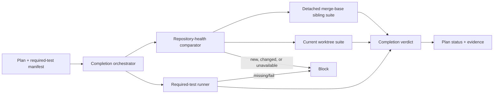
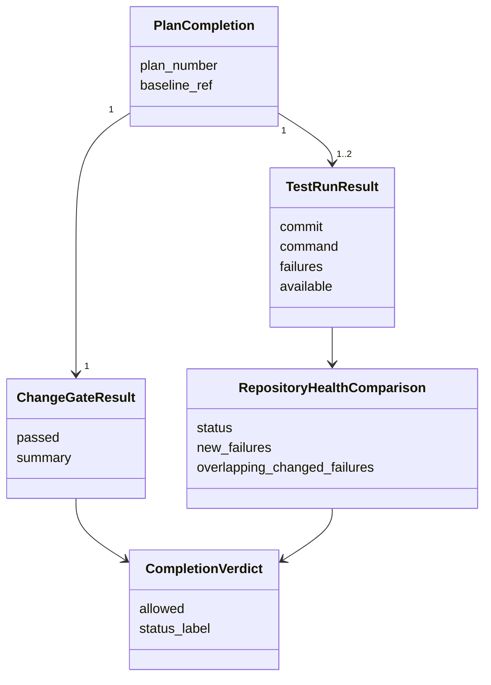
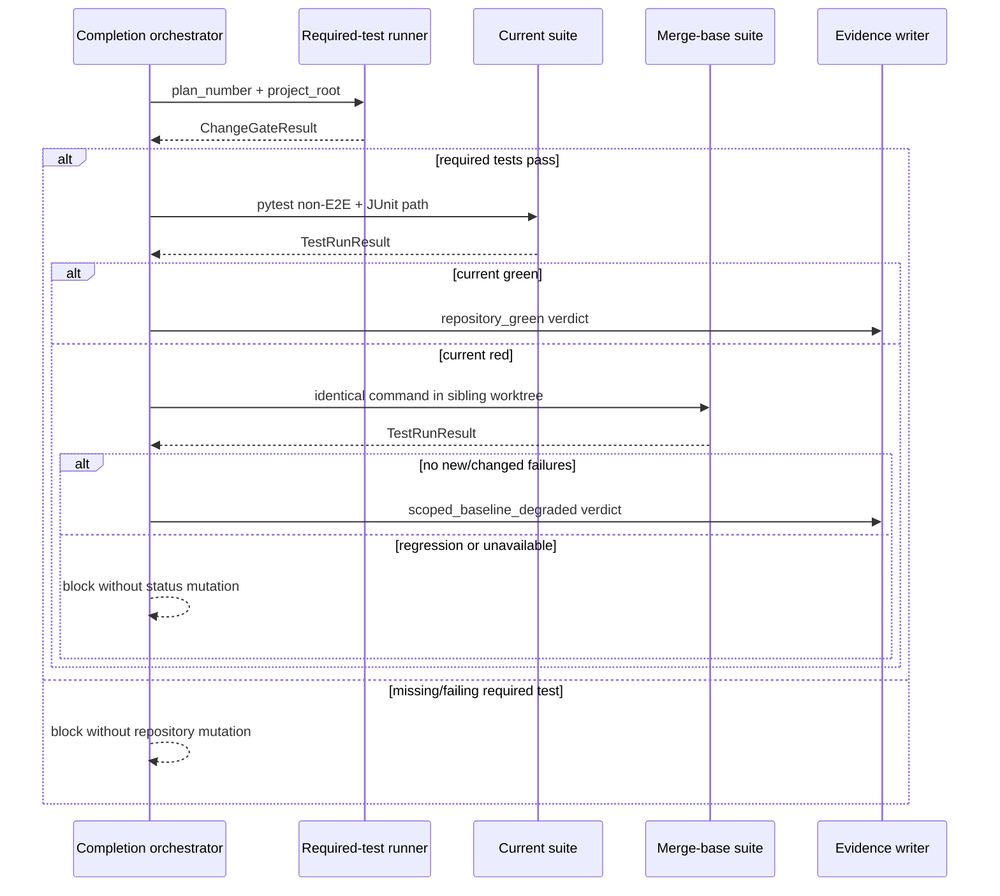

# Plan #67: Scoped Plan Completion and Repository Health

**Status:** 🚧 In Progress
**Type:** policy + deterministic implementation
**Priority:** High
**phase_ref:** "portable verification enforcement"
**goal_ref:** "ecosystem-context-integrity"
**adrs_referenced:** ["META-ADR-0003", "META-ADR-0011"]
**research_citations:** []
**Blocked By:** None
**Blocks:** honest completion of bounded plans in repositories with visible baseline debt

`trace_evaluable: false # deterministic governance tooling`

## Gap

**Current:** plan completion runs the whole non-E2E suite as an unconditional
gate. One unrelated failure prevents completion even when every declared test
and acceptance criterion for the change passes.

**Target:** required change evidence always blocks when red; repository health
always runs and remains visible, but only new or changed baseline failures block
a bounded plan.

**Why:** verification should prevent relevant regressions without turning every
plan into an unbounded repository repair.

## Frame

### Goal

Make `complete_plan.py` distinguish scoped change verification from repository
health and issue an honest, evidence-bearing completion verdict for both green
and baseline-degraded repositories.

### Constraints and non-goals

- Preserve fail-loud behavior when required tests, comparison evidence, E2E, or
  doc coupling are unavailable or fail.
- Do not add a silent force/waiver path.
- Do not build general CI orchestration, flaky-test detection, non-pytest
  adapters, or probabilistic impact mapping.
- Do not require a permanently hand-maintained failure allowlist.
- Keep the normal green-repository path to one full-suite execution.
- Full-green release/promotion policy remains available as a stronger gate.

### Modality and borrow-versus-build

This change is deductive: the accepted and rejected verdicts can be specified
before implementation. Reuse pytest's JUnit XML output for structured results
and Git's detached worktrees for a symmetric merge-base run. Hand-roll the
small comparison/decision layer because the relevant failure is policy
semantics, not a third-party runner feature.

## References Reviewed

- `scripts/complete_plan.py`
- `scripts/check_plan_tests.py`
- `tests/test_complete_plan.py`
- `patterns/17_verification-enforcement.md`
- `patterns/03_testing-strategy.md`
- `PLANNING_OPERATING_MODEL.md`
- `docs/plans/TEMPLATE.md`
- `adr/0003-plan-gate-hierarchy.md`
- `project-meta/docs/plans/219_foundation-v1-3-identity-contract-reconciliation.md`
- `project-meta/policy_friction.md`, 2026-07-14 completion-gate entry
- Cross-session memory check for completion-gate findings — no matching findings
- [Pytest JUnit XML output](https://docs.pytest.org/en/stable/how-to/output.html#creating-junitxml-format-files)
- [Pytest xfail guidance](https://docs.pytest.org/en/stable/how-to/skipping.html)
- [Git worktree documentation](https://git-scm.com/docs/git-worktree.html)

## Requirements → Boundaries → Domain Model → Contracts → Schema

### Requirements

1. A plan's declared required tests run first and always block on absence or
   failure.
2. The non-E2E repository suite always runs and records structured evidence.
3. A green repository suite licenses ordinary `Complete`.
4. A red current suite triggers the identical command at the merge base in a
   detached sibling worktree using the same interpreter.
5. Comparison captures untruncated pytest assertion values before normalizing
   checkout roots, worktree-derived checkout labels, and run-generated pytest
   temporary-session roots.
6. New failures, changed normalized failure evidence, and failures in changed
   baseline test files block completion.
7. Only unchanged baseline failures license scoped/degraded completion.
8. Baseline setup, execution, or result-parsing failure is `unavailable` and
   blocks completion.
9. Evidence records the baseline commit, commands, counts, identities, changed
   paths, and verdict.

### Boundary diagram



| Boundary | Owns | Invariant | Failure behavior | Must not own |
|---|---|---|---|---|
| Required-test runner | Plan-declared change checks | Every declared test exists and passes | Block | Repository health policy |
| Repository-health comparator | Same-command current/baseline evidence | Baseline runs in symmetric worktree layout | Return typed unavailable/regressed/degraded/green | Acceptance-criterion judgment |
| Completion orchestrator | Final conjunction and status label | No unavailable evidence counts as pass | Block without mutation | Hiding baseline debt |
| Evidence writer | Durable result summary | Status and evidence describe the same verdict | Fail before status mutation | Reclassifying failures |

### Domain model



### Contracts and data flow



### Derived schema

The implementation uses frozen dataclasses for `TestFailure`, `TestRunResult`,
and `RepositoryHealthComparison`. `TestFailure` carries a stable identity plus a
path-neutral hash and bounded excerpt of failure details. Plan evidence renders
a compact YAML summary; the complete machine-readable comparison is written as
a JSON evidence artifact. No persistent allowlist schema is introduced.

### Backward verdict pass

Final `CompletionVerdict` ← repository comparison + required/E2E/doc results ←
JUnit failure identities + changed paths + baseline commit ← current suite and
detached merge-base suite. If any predecessor is missing, the verdict is
blocking rather than guessed.

## Approved seam mockup

Brian approved proceeding with the scoped/baseline model on 2026-07-14.

```yaml
completion_scope: scoped
change_gate: passed
repository_health:
  status: baseline_degraded
  baseline_commit: abc123
  current_failures: 6
  baseline_failures: 6
  new_failures: 0
  changed_baseline_failures: 0
status: "Complete (scoped; repository baseline degraded)"
```

## Files Affected

- `scripts/complete_plan.py`
- `scripts/check_plan_tests.py`
- `scripts/install_governed_repo.py`
- `tests/test_complete_plan.py`
- `tests/test_check_plan_tests.py`
- `tests/test_install_governed_repo.py`
- `tests/test_completion_repository_health.py`
- `PLANNING_OPERATING_MODEL.md`
- `patterns/03_testing-strategy.md`
- `patterns/15_plan-workflow.md`
- `patterns/17_verification-enforcement.md`
- `templates/plan.md.template`
- `docs/plans/TEMPLATE.md`
- `docs/plans/CLAUDE.md`
- `adr/README.md`
- `adr/0011-scoped-plan-completion-and-repository-health.md`
- `docs/plans/67_scoped-plan-completion-and-repository-health.md`
- completion evidence generated by the verified gate

## Risk-Ordered Slice

### Slice 1 — Same-environment relevant-regression completion

- **Advances:** restores proportional plan completion without losing global
  regression visibility.
- **De-risks:** false passes from omitted required tests and false blocks from
  unrelated repository debt.
- **Success:** real Git/pytest controls accept one unchanged worktree-root
  baseline failure and reject a new failure, a changed baseline test, and an
  unavailable comparison.
- **Audit charter:** pilot-stage governance tooling; next decision is whether
  source-repo dogfood and one consumer dry run are licensed; budget is the five
  verdict classes plus one focused review; non-goals are releases, flaky-test
  quarantine, and non-pytest runners; stop when both-sign controls and original
  counterexamples pass.
- **Cleanup:** align canonical policy/template text and remove unconditional
  full-green plan-completion language from active surfaces.
- **Done when:** required tests and both-sign controls pass, framework dogfood
  produces truthful evidence, findings are dispositioned, and the concern
  register is triaged.

## Required Tests

### New Tests (TDD)

| Test File | Test Function | What It Verifies |
|---|---|---|
| `tests/test_completion_repository_health.py` | `test_unchanged_worktree_failure_is_baseline_debt` | Same-layout failure on both commits permits scoped completion |
| `tests/test_completion_repository_health.py` | `test_green_repository_does_not_create_baseline_worktree` | Green repositories complete without a second suite run |
| `tests/test_completion_repository_health.py` | `test_new_failure_blocks_completion` | Current-only failure is a regression |
| `tests/test_completion_repository_health.py` | `test_changed_baseline_test_file_blocks_completion` | Same test identity cannot bypass overlap guard |
| `tests/test_completion_repository_health.py` | `test_changed_failure_cause_blocks_even_when_test_file_is_unchanged` | Same node ID with different failure evidence is a regression |
| `tests/test_completion_repository_health.py` | `test_unavailable_baseline_blocks_completion` | Missing comparison never becomes a pass |
| `tests/test_complete_plan.py` | `test_required_plan_tests_block_before_repository_health` | Declared change gate is wired as blocking |
| `tests/test_complete_plan.py` | `test_degraded_repository_writes_scoped_status` | Status and evidence preserve degraded health truth |
| `tests/test_complete_plan.py` | `test_doc_coupling_unavailable_is_blocking` | Missing/crashed coupling evidence cannot silently pass |
| `tests/test_check_plan_tests.py` | `test_run_tests_uses_current_python_interpreter` | Required tests use the same Python environment as completion |
| `tests/test_check_plan_tests.py` | `TestFindTestClass::test_top_level_function_after_class_returns_none` | Required test node IDs preserve top-level placement after classes |
| `tests/test_complete_plan.py` | `test_policy_surfaces_separate_change_gate_from_repository_health` | Canonical policy/templates preserve the two-verdict model |

### Existing Tests (Must Pass)

| Test Pattern | Why |
|---|---|
| `tests/test_complete_plan.py` | Completion status, evidence, and coordination behavior remain compatible |
| `tests/test_install_governed_repo.py` | Portable installed scripts remain synchronized |

## Acceptance Criteria

| ID | Criterion | Required evidence | Initial grade | Closes when |
|---|---|---|---:|---|
| C67-1 | Required plan tests are the always-blocking change gate. | source + test | D | positive and missing/failing controls pass |
| C67-2 | Green repository suite produces ordinary completion. | source + test | D | green control passes |
| C67-3 | Unchanged same-layout baseline failures permit scoped/degraded completion. | source + test | D | real Git/pytest positive control passes |
| C67-4 | New and changed baseline failures block. | source + test | D | both negative controls pass |
| C67-5 | Unavailable or unparsable baseline blocks. | source + test | D | unavailable negative control passes |
| C67-6 | Evidence and status expose both change and repository verdicts. | source + test | D | render/readback tests pass |
| C67-7 | Canonical policy, pattern, and templates no longer require unconditional full-green plan completion. | source + test | D | text checks and self-test pass |

### Initial coverage distribution

| Grade | Count | Share |
|---|---:|---:|
| A | 0 | 0% |
| B | 0 | 0% |
| C | 0 | 0% |
| D | 7 | 100% |
| F | 0 | 0% |

No new hard behavior is considered calibrated until both positive and negative
controls pass. This report is the visibility baseline required by the
coverage-report procedure.

## Failure Modes

| Failure | Detection | Recovery |
|---|---|---|
| Required tests omitted or unparseable | required-test command fails | correct the plan manifest; do not infer scope |
| Baseline ref unavailable | Git resolution fails | supply a valid configured ref or restore remote metadata |
| Baseline worktree cannot run | no valid JUnit result | fix environment parity; remain blocked |
| New test failure | identity absent from baseline | repair regression or narrow an erroneously broad suite through policy review |
| Baseline test file changed | failure file intersects Git diff | repair it; future durable waiver design is separate |
| Cleanup leaves baseline worktree | post-run removal failure | fail loud and print exact recovery path |

## Pre-Made Decisions

1. Baseline defaults to the merge base with the auto-detected remote/default
   branch and is CLI-configurable.
2. Comparison uses exact JUnit test identities, not terminal-output regexes.
3. The baseline runs only after a current failure, avoiding a second run on
   healthy repositories.
4. Baseline checkout is a detached sibling under canonical `worktrees/`.
5. Any comparison/setup failure blocks.
6. No waiver surface ships in this slice.
7. Existing E2E and doc-coupling behavior remains blocking and unchanged.

## Concern Register

| Concern | Status | Disposition / promotion trigger |
|---|---|---|
| Same node identity can fail for a different source-level cause | mitigated | normalized failure-detail changes and changed-test-file overlap block; revisit after reliable impact mapping |
| Double suite runtime on degraded repos | accepted | only red current runs pay the cost; revisit if it becomes disproportionate |
| Non-pytest consumers | deferred | add an adapter only when a real consumer requires it |
| Durable waivers for changed known failures | deferred | design only after an actual justified case; no silent bypass now |
| Baseline tests may leave files in temporary worktree | open | cleanup must be tested and fail loud with recovery path |

## Stop Conditions

1. Stop rather than allowing completion if baseline evidence cannot be made
   machine-readable and symmetric.
2. Do not mutate consumer test files to manufacture a green baseline.
3. Do not expand this slice into general CI or flaky-test management.

## Adversarial Review

**Charter:** pilot-stage deterministic governance tooling; the next decision is
whether source-repo dogfood and one consumer dry run are licensed; budget is
three blocker groups and one discovery pass; non-goals are release automation,
flaky-test quarantine, non-pytest runners, and generalized impact mapping; stop
when the green, degraded, new-failure, changed-cause, changed-test, and
unavailable cases discriminate correctly.

**Causal path:** plan-required manifest → blocking change result; current JUnit
run → same-layout merge-base JUnit run when red → identity/detail/changed-path
comparison → completion verdict → durable status and evidence.

Two blockers were found and fixed:

1. The initial comparator used only test identity plus changed-test-file
   overlap. A real counterexample changed `app.py` so the same unchanged test
   failed with different values; the comparator incorrectly returned
   `baseline_degraded`. Failure records now include a path-neutral hash of the
   JUnit type/message/traceback. The original counterexample now returns
   `regressed`.
2. The initial default hardcoded `origin/main`. A local Git repository with a
   valid `main` branch but no remote therefore returned `unavailable` unless an
   agent supplied a flag. Baseline selection now prefers the remote default and
   then checks explicit `origin/main`, `origin/master`, `main`, and `master`
   candidates. The no-remote real-Git control now selects `main` and passes.
3. The canonical installer copied the new completion script and its package
   dependencies, but invoking `scripts/meta/complete_plan.py --help` in a clean
   consumer failed because direct script execution put only `scripts/meta/` on
   `sys.path`. The script now locates the nearest governed-repo root containing
   `enforced_planning/` before importing it. The installed-layout execution
   control now passes for both completion scripts.

No additional current blocker survived the bounded pass. Flaky failures,
non-pytest adapters, durable waivers, and generalized source-to-test impact
mapping remain explicitly deferred.

**Verdict:** proceed to source-repo dogfood and a bounded consumer dry run.
