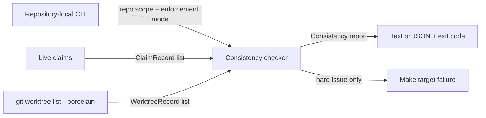

# Plan #68: Worktree residency reconciliation

**Status:** In Progress
**Type:** implementation
**Priority:** Critical
**phase_ref:** Phase 9 fleet adoption
**goal_ref:** truthful-governed-repo-lifecycle
**Blocked By:** none
**Blocks:** trustworthy session/worktree status and future fleet cleanup

## Frame

### Goal

Every registered auxiliary worktree must be visible in a repository-local audit. A worktree outside the sanctioned `<repo>/worktrees/<branch>/` root must be rejectable by an explicit tested enforcement mode, while claimless worktrees inside that root remain visible report-only debt until their semantic dispositions are known.

### Constraints and non-goals

- Reuse the existing package-backed consistency checker; do not add another registry.
- Do not merge or delete historical branches.
- Do not modify active Plans #66 or #67.
- Do not infer semantic dispositions from Git state.
- Do not turn all claimless worktrees into hard failures in this slice.
- Keep the CLI usable from both the main checkout and a linked worktree without hardcoded home paths.

### Decision and rationale

This is a deductive extension of `enforced_planning.coordination_consistency`, not a new subsystem. Git supplies the registered checkout paths, claims supply active ownership, and the canonical repository root deterministically supplies the sanctioned worktree directory. The existing checker is the borrow decision; a second scanner would create competing truth.

## Requirements → boundaries → domain model → contracts

### Requirements

1. A repository-local command audits only claims for the selected repository instead of failing on unrelated ecosystem claims.
2. Every linked non-main checkout outside `<canonical-repo>/worktrees/` produces a distinct path-policy issue.
3. Report mode makes path violations visible without failing.
4. Explicit enforcement mode turns the same violation into a hard failure.
5. A claimed checkout under the sanctioned root passes the path rule.
6. An unclaimed checkout under the sanctioned root remains a warning, preserving the semantic-disposition boundary.
7. Push safety resolves repository identity from the canonical checkout rather than a worktree branch-directory name.

### Boundaries and data flow

| Boundary | Owns | Invariant | Failure behavior | Must not own |
|---|---|---|---|---|
| CLI | repository selection and enforcement opt-in | selected repo paths resolve deterministically | invalid/missing repo fails loud | semantic branch disposition |
| Checker | claim/worktree matching and path-policy classification | main checkout excluded; every auxiliary checkout evaluated | hard issues return non-zero | merging, deletion, archival |
| Git | registered worktree state | porcelain output is authoritative for residency | Git command failure raises | activity intent |
| Claims | active ownership evidence | only live claims count | missing match remains visible | proof that a branch is useful |

### Domain model and contract sketch

- `WorktreeRecord`: existing registered-checkout record.
- `ConsistencyIssue`: existing typed issue record; new code is `worktree-outside-sanctioned-root`.
- `repo_roots: dict[str, Path]`: selected canonical repositories.
- `scope_claims_to_repos: bool`: CLI selection policy, not persisted state.
- `enforce_sanctioned_worktree_root: bool`: visibility-to-enforcement switch.
- Output remains the existing JSON/text consistency report and `0`/`1` exit contract.

No new persisted schema is required. The report schema already carries severity, code, repository, branch, and worktree path.

## Capabilities

| Capability | Input contract | Output contract | Producer | Consumer | Cost |
|---|---|---|---|---|---|
| repository-local coordination audit | canonical repo selection, live `ClaimRecord` values, enforcement flag | existing consistency report plus `0`/`1` exit status | `enforced_planning.coordination_consistency` | repo Make target and agents | free/deterministic |

This extends an existing internal framework capability. It does not introduce a new cross-project function seam or an LLM/tool contract, so no new Pydantic or tool-registry surface is required.

## Acceptance criteria and baseline coverage

| ID | Criterion | Required evidence | Baseline grade | Positive control | Negative control |
|---|---|---|---|---|---|
| AC1 | Repository-local scope ignores unrelated live claims | test | D — plan only | selected-repo claim and worktree match | unrelated project claim does not become `claim-project-out-of-scope` |
| AC2 | Sanctioned linked worktree passes path policy | test | D — plan only | `<repo>/worktrees/plan-x` | n/a |
| AC3 | Retired sibling path is visible in report mode | test | D — plan only | issue code appears as warning | n/a |
| AC4 | Retired sibling path fails in enforcement mode | test | D — plan only | sanctioned path still exits 0 | `<repo>_worktrees/plan-x` exits 1 with the path issue |
| AC5 | Claimless sanctioned worktree remains warning-only | test | C — existing fixture, but old fixture uses the retired path | existing unclaimed warning behavior | path-policy enforcement does not misclassify semantic inactivity |
| AC6 | Real repository audit passes after retired-path cleanup while reporting current claimless debt | observed | B after execution | live workspace command | retired path recreated would fail |
| AC7 | Push safety recognizes the live branch claim from an in-repo worktree | test | F — reproduced failure during implementation | real-Git claimed worktree | branch-directory name must not become project identity |

Enforcement is licensed only after AC2 and AC4 both have automated controls. AC1 prevents the local Make target from failing on unrelated ecosystem claims.

## Failure modes and recovery

| Failure | Detection | Recovery |
|---|---|---|
| Canonical root inferred from worktree basename | repo selection points at branch directory | resolve through Git common directory / existing worktree path helper |
| Unrelated claims hard-fail local audit | `claim-project-out-of-scope` for another repo | filter only when repository-local mode is explicit |
| Custom path silently passes | missing path-policy issue | compare resolved path to resolved `<repo>/worktrees/` root |
| Current historical debt blocks immediately | claimless sanctioned checkout returns non-zero | keep unclaimed severity warning-only in this slice |
| Checker starts deleting state | mutation appears in implementation | reject; this component is read-only |

## Thin slice and review charter

Slice 1 is the entire bounded change: repository-local scope → registered-path classification → JSON/text result → Make target, with positive and negative real-Git tests.

- Stage: operational hardening of an existing shared-infrastructure checker.
- Next decision: whether this path rule is safe to include in the repository gate and later propagate.
- Review budget: one focused deterministic refutation plus diff review.
- Non-goals: historical semantic merging, automatic cleanup, age thresholds, fleet propagation.
- Stopping rule: stop after both path signs, repository scoping, focused tests, real-workspace run, and cleanup pass agree.

## Concern register

| Concern | Status | Disposition |
|---|---|---|
| The sanctioned creator reuses one Codex thread ID across Plan #66 and Plan #68 tracker records. | deferred | Claims and tracker paths remain distinct; record separately rather than expanding this plan. |
| Plan #67 currently owns unmerged edits to `docs/plans/CLAUDE.md`. | mitigated | Do not edit the plan index in this branch; relate this plan through `relationships.yaml` and reconcile the index after Plan #67 lands. |
| Existing stale instructions still advertise `<repo>_worktrees/`. | deferred | Fix after path-policy behavior lands, in a separate documentation slice that avoids the other agent's documentation-policy work. |

## Verification

- Focused real-Git tests for selected-repo scope and both path-policy signs.
- Existing coordination consistency tests.
- Existing push-safety tests plus the in-repo worktree identity regression.
- Ruff and strict mypy over the changed Python closure.
- Real repository-local JSON audit from this worktree.
- Proportional pre-landing review and cleanup.
