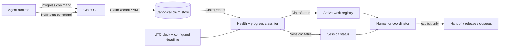
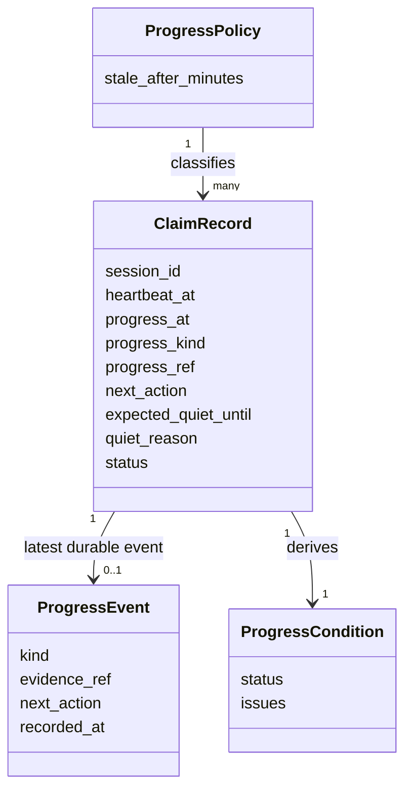
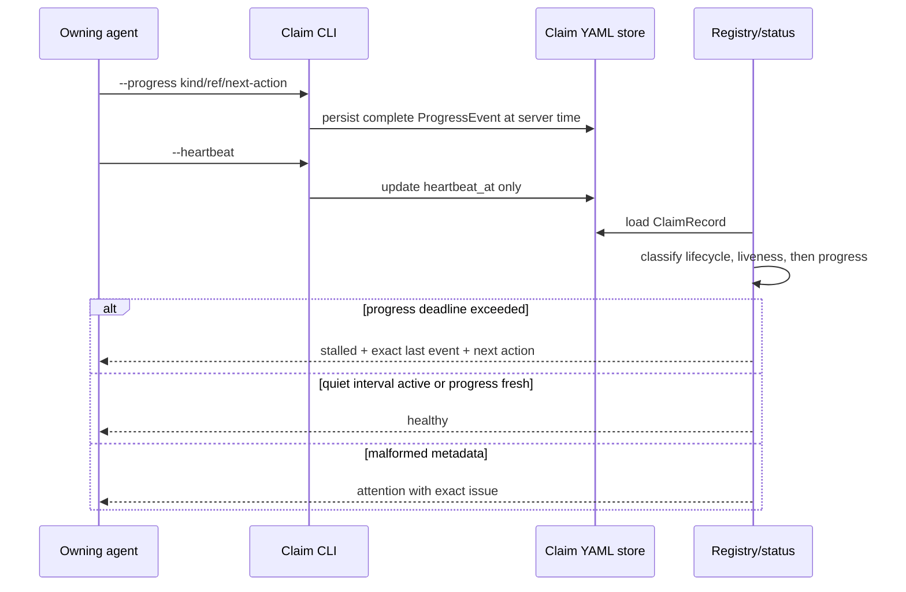

# Plan #70: Progress Leases And Stalled-Lane Visibility

**Status:** In Progress
**Type:** implementation
**Priority:** High
**phase_ref:** "Coordination runtime maintenance"
**goal_ref:** "truthful-active-lane-progress"
**adrs_referenced:** ["META-ADR-0012"]
**research_citations:** []
**Blocked By:** None
**Blocks:** [future] blocker-before-broadening enforcement and coordinated stalled-lane handoff

---

## Mission And Approval

Make active coordination state distinguish probable runtime liveness from
durable outcome progress, without automatically releasing claims or destroying
work.

Brian approved the concrete policy behavior—separate progress from heartbeat,
a configurable default 60-minute deadline, report-only stalled status, and no
automatic takeover—and then instructed the agent to continue. That instruction
is recorded as the explicit low-risk override of the synthetic seam-mockup
pause. The approved representation is
`70_progress_lease_contract_mockup.md`.

## Gap

**Current:** `heartbeat_at` and lifecycle checks classify claims as healthy,
weak, or stale. A heartbeat refresh also updates the tracker timestamp. No
canonical field says when the lane last produced durable progress, what that
progress was, or what action comes next. A live writer can therefore appear
healthy indefinitely while broadening scope around an unresolved blocker.

**Target:** Claims record explicit progress events. Status surfaces report a
live but non-advancing claim as `stalled` after a configurable deadline. Known
long operations can declare a bounded quiet interval. Heartbeats, git dirt, and
file mtimes cannot renew progress. Stall detection never releases or prunes a
claim.

**Why:** Coordination must make lack of progress visible early enough to repair
or hand off a lane before hours are lost, while preserving ownership and dirty
work.

## References Reviewed

- `CLAUDE.md` — continuous execution, plan-bound lane, and commit discipline.
- `PLANNING_OPERATING_MODEL.md` — evidence-before-enforcement and scoped review.
- `docs/guides/WORKTREE_COORDINATION_OPERATOR_GUIDE.md` — canonical claim,
  heartbeat, stale-state, and ownership semantics.
- `docs/guides/CONTINUOUS_EXECUTION_CONTRACT.md` — circuit breaker and blocked
  task behavior.
- `docs/plans/29_session_heartbeats_and_agent_liveness.md` — existing
  configurable liveness lease.
- `docs/plans/30_session_bootstrap_contract_and_tracker.md` — compact claim plus
  richer tracker split.
- `enforced_planning/coordination_claims.py` — canonical claim schema, CLI,
  heartbeat, health classification, and pruning behavior.
- `enforced_planning/active_work_registry.py` — derived claim/lane health and
  Markdown status.
- `enforced_planning/session_contracts.py` and
  `enforced_planning/session_lifecycle.py` — tracker and session status seams.
- `tests/test_check_coordination_claims.py`,
  `tests/test_generate_active_work_registry.py`, and `tests/test_session_cli.py`
  — current liveness and registry controls.
- `agent-memory recall 'active decisions progress lease coordination' --project enforced-planning`
  — no relevant active decision superseded this work.

## Research Basis For This Slice

- [Kubernetes Deployment progress deadlines](https://kubernetes.io/docs/concepts/workloads/controllers/deployment/)
  — a controller can remain operational while its rollout fails to progress;
  the deadline produces a reported condition and does not itself destroy or
  roll back the workload.
- Local prompt-design research on multi-agent orchestration and circuit
  breakers — verify outcomes, expose bounded progress, and avoid indefinite
  retries or unverified sub-agent activity.

Borrow Kubernetes' separate progress-deadline/status pattern. Keep the existing
local claim store and hand-roll the small classifier/CLI extension because its
failure semantics belong in this framework's ownership model.

## Modality Assessment

| Part | Mode | Why | Planning Treatment |
|---|---|---|---|
| Progress event schema and CLI | Deductive / plan-first | Required fields and invalid combinations are predictable. | Define strict fields and negative tests before implementation. |
| Deadline classification | Deductive / plan-first | Timestamp comparison and precedence are deterministic. | Unit-test boundaries with a frozen clock and configurable threshold. |
| Operator effectiveness | Exploratory, deferred | The best deadline and whether agents record honest events require fleet evidence. | Keep the threshold configurable and collect report-only observations before enforcement. |

**Exploratory readout:** after report-only rollout, how often does `stalled`
identify genuinely non-advancing work versus a legitimate quiet operation?

**Step-down path:** every stalled aggregate exposes the exact claim, progress
timestamp, kind, evidence reference, next action, quiet interval, and deadline.

## Requirements

| ID | Requirement | Pass condition | Failure example |
|---|---|---|---|
| R1 | Liveness and progress remain independent | Heartbeat changes only heartbeat/update timestamps. | Heartbeat silently renews `progress_at`. |
| R2 | Progress is explicit and durable | A progress event requires kind, non-empty evidence ref, and next action. | File mtime or dirty status counts as progress. |
| R3 | Deadline is configurable | `COORDINATION_PROGRESS_STALE_MINUTES` controls deterministic classification; default is 60. | Hard-coded project-specific timeout. |
| R4 | Quiet periods are bounded and visible | A future `expected_quiet_until` plus reason suppresses stall only until its deadline. | “Tests running” suppresses stalls forever. |
| R5 | Stall is report-only | Runtime/registry status becomes `stalled`; prune and release paths ignore it. | Stalled claim is deleted or reassigned. |
| R6 | Existing state remains compatible | Claims without progress fields load and retain their prior health. | Fleet claims all become stalled at rollout. |
| R7 | Status has concrete recovery context | Registry/session output exposes last progress and next action. | User sees only an unexplained warning. |
| R8 | Status precedence is truthful | Lifecycle/liveness breakage is `stale`; otherwise expired progress is `stalled`; weak metadata remains `weak`. | Dead runtime is mislabeled merely stalled. |

## Boundaries



| Boundary | Owned state | Business rules and invariants | Inputs / outputs | Failure behavior | Must not own |
|---|---|---|---|---|---|
| Claim CLI | Claim mutation | Only an owning session records progress; required fields travel together; heartbeat does not mutate progress. | CLI args → persisted `ClaimRecord`. | Reject invalid or non-owned updates. | Inferring semantic progress from files. |
| Claim store | Canonical ownership record | Additive fields; legacy claims remain readable. | YAML ↔ normalized `ClaimRecord`. | Malformed optional timestamps surface as issues. | Derived lane status. |
| Classifier | No durable state | `stale` outranks `stalled`; quiet intervals are temporary; deadline is configured. | Claim + clock/config → issues/status. | Fail visible on invalid progress metadata. | Releasing or transferring claims. |
| Registry/session status | Derived views | Show exact progress context and recovery action. | Classified claims → JSON/Markdown/text. | Attention status, never silent omission. | Becoming a second ownership authority. |
| Handoff/release lifecycle | Existing claim ownership transitions | Only explicit owner/coordinator operations change ownership. | Explicit command → lifecycle transition. | Preserve dirty/unique work protections. | Automatic reaction to `stalled`. |

## Domain Model



## Contracts And Derived Schema

### Claim fields

The additive normalized/persisted fields are:

```text
progress_at: ISO-8601 UTC timestamp | absent
progress_kind: claim_started | verified_commit | new_diagnostic | blocker | handoff | absent
progress_ref: non-empty durable evidence reference | absent
next_action: non-empty operator-readable action | absent
expected_quiet_until: ISO-8601 UTC timestamp | absent
quiet_reason: non-empty text | absent
```

The four progress-event fields are all present or all absent. Quiet fields are
both present or both absent. Claim creation stamps a `claim_started` event.
Legacy records with none of these fields remain compatible.

### Mutation contract

`record_progress_claims(...)` resolves and checks the owning runtime exactly as
heartbeat does, stamps server time, and writes a canonical event. It may set or
clear the bounded quiet interval. `heartbeat_claims(...)` cannot mutate any of
these fields.

### Classification contract

`claim_progress_issues(claim, now)` returns:

- no issues for non-live or legacy uninstrumented claims;
- `invalid_progress_at` or `invalid_expected_quiet_until` for malformed time;
- no deadline issue while a valid quiet interval is active; or
- `stalled_progress_lease` when `now - progress_at` exceeds the configured
  deadline.

`claim_runtime_status` precedence is `stale` → `stalled` → existing
`healthy|weak` states. `prune_stale` remains limited to broken lifecycle or
liveness and does not consume progress issues.

## Runtime Contract Inventory

| Object | Producer | Consumer | Required fields | Lifetime | Failure modes |
|---|---|---|---|---|---|
| `ClaimRecord` | Claim CLI/session lifecycle | classifier, registry | existing claim fields plus optional progress group | claim lifetime | malformed legacy YAML, invalid timestamp |
| `ProgressEvent` | owning runtime through progress command | claim store | kind, evidence ref, next action, server timestamp | latest event on claim | missing field, wrong owner |
| `ProgressCondition` | classifier | registry/session status | status and issues | derived per read | wrong clock/config, precedence bug |

## Backward Runtime Pass

1. **Final payload:** session/registry row says `stalled`, last durable event,
   age, and next action.
2. **Producer:** deterministic classifier chooses status from normalized claim,
   UTC time, and configured deadline.
3. **Evidence/preconditions:** explicit persisted progress fields; optional
   quiet fields; existing liveness/lifecycle issues.
4. **Compiler outputs:** claim creation and `--progress` write structurally
   complete event groups; `--heartbeat` preserves them byte-for-value.
5. **Storage refinement:** additive YAML fields on canonical claims; no second
   state store.

## Worked Runtime Example

| Stage | State / action | Result |
|---|---|---|
| Start | Claim created at 00:00 with fresh heartbeat and `claim_started`. | `healthy`. |
| Progress | At 00:20, owner records commit `abc123` and next action. | `progress_at=00:20`; `healthy`. |
| Activity only | Heartbeats at 00:40, 01:00, and 01:20. | Heartbeat stays fresh; progress remains 00:20. |
| Deadline | Status read at 01:21 with 60-minute policy. | `stalled_progress_lease`; runtime still live. |
| Recovery | Owner records a blocker reference and handoff-ready next action. | New progress event at 01:25; status returns `healthy`; ownership unchanged. |

## Data Flow



## Capabilities

| Capability | Input Schema | Output Schema | Producer | Consumer(s) | Cost Tier |
|---|---|---|---|---|---|
| `record_progress_claims` | owning session selector + typed progress fields | count, scopes, session ID, timestamp | `coordination_claims` | claim CLI, later session CLI | free |
| `claim_progress_issues` | `ClaimRecord` + optional UTC time | `list[str]` | `coordination_claims` | registry and session status | free |

### Capability Validation

- [ ] Additive fields normalize and serialize without raw cross-project dict seams.
- [ ] CLI rejects incomplete field groups and non-owned updates.
- [ ] Registry and session consumers use the same classifier.
- [ ] Installed wrapper remains an import-only adapter to canonical package code.

## Failure Modes And Recovery

| Failure | Detection | Required response |
|---|---|---|
| Heartbeat renews progress | Negative test compares progress fields before/after heartbeat. | Fix mutation boundary; do not weaken test. |
| Legacy fleet becomes stalled | Legacy-claim compatibility test. | Restore absent-field compatibility. |
| Quiet period masks work forever | Frozen-clock test crosses `expected_quiet_until`. | Resume ordinary deadline classification. |
| Stalled claim is pruned | `prune_stale` negative with stalled-only claim. | Keep stall report-only. |
| Dead runtime labeled stalled | Precedence test with stale heartbeat and expired progress. | Return `stale`. |
| File churn counts as progress | No file/git inspection exists in classifier; structural assertion. | Remove inferred activity path. |
| Same deterministic failure repeats three times | Existing circuit breaker. | Record blocker and move to next unblocked slice. |

## Files Affected

- `adr/0012-progress-leases-separate-liveness-from-advancement.md` (create)
- `adr/README.md` (modify)
- `docs/plans/70_progress_leases_and_stalled_lane_visibility.md` (create)
- `docs/plans/70_progress_lease_contract_mockup.md` (create)
- `enforced_planning/coordination_claims.py` (modify)
- `enforced_planning/active_work_registry.py` (modify)
- `enforced_planning/session_lifecycle.py` (modify if session status needs fields)
- `scripts/session_status.py` (modify if text rendering needs fields)
- `docs/guides/WORKTREE_COORDINATION_OPERATOR_GUIDE.md` (modify)
- `docs/reference/CONFIG_REFERENCE.md` (modify)
- `tests/test_check_coordination_claims.py` (modify)
- `tests/test_generate_active_work_registry.py` (modify)
- `tests/test_session_cli.py` (modify if session rendering changes)

`docs/plans/CLAUDE.md` and `ROADMAP.md` are deliberately deferred until the
active Plan 67/69 owners release their overlapping authority edits; the Plan 70
claim and this numbered file remain the execution authority meanwhile.

## Slice Roadmap

### Slice 1 — Report-only progress lease

- **Advances:** truthful active-lane state.
- **Vertical scope:** claim creation/update → classifier → JSON/Markdown/session
  status → installed wrapper parity.
- **De-risks:** false healthy state and accidental work loss.
- **Success:** focused tests prove fresh, stalled, quiet, legacy, heartbeat
  independence, precedence, and no-prune behavior.
- **Audit charter:** product-stage shared-infrastructure maintenance; license
  report-only rollout; one focused adversarial pass; non-goals are automatic
  release, scope blocking, or fleet threshold tuning; stop when the original
  counterexamples and full relevant suite pass after any fixes.
- **Cleanup:** remove duplicate status logic and reconcile docs/concerns.
- **Done when:** tests pass, focused audit findings are dispositioned, original
  counterexamples re-pass, docs are current, and verified work is committed.

### Slice 2 — Evidence-guided stall response

After report-only observations, decide whether to add blocker-before-broadening
enforcement, mandatory inbox acknowledgement, or assisted handoff. This slice
requires a separate plan/readout and may not infer its policy from Slice 1.

## Required Tests

### New Tests (TDD)

| Test file | Test | What it proves |
|---|---|---|
| `tests/test_check_coordination_claims.py` | progress command writes a complete event | Explicit durable mutation works. |
| same | heartbeat preserves progress fields | Liveness cannot launder activity into progress. |
| same | expired progress with fresh heartbeat is stalled | Core incident is detected. |
| same | quiet interval expires deterministically | Quiet work is bounded. |
| same | legacy claim remains compatible | Rollout does not create false fleet alarms. |
| same | stalled-only claim is not pruned | Visibility does not seize ownership. |
| `tests/test_generate_active_work_registry.py` | claim/lane/summary expose stalled state | Operator surface is end-to-end. |
| `tests/test_session_cli.py` | session output includes progress context | Agent-facing status matches registry truth. |

### Existing Tests (Must Pass)

| Command | Why |
|---|---|
| `pytest -q tests/test_check_coordination_claims.py tests/test_generate_active_work_registry.py tests/test_session_contracts.py tests/test_session_cli.py` | Coordination/session contract regression. |
| `python scripts/self_test.py --docs` | Plan and documentation coherence. |
| `python scripts/check_markdown_links.py adr/0012-progress-leases-separate-liveness-from-advancement.md docs/plans/70_progress_leases_and_stalled_lane_visibility.md docs/plans/70_progress_lease_contract_mockup.md docs/guides/WORKTREE_COORDINATION_OPERATOR_GUIDE.md` | Touched links resolve. |
| `ruff check enforced_planning/coordination_claims.py enforced_planning/active_work_registry.py enforced_planning/session_lifecycle.py scripts/session_status.py tests/test_check_coordination_claims.py tests/test_generate_active_work_registry.py tests/test_session_cli.py` | Static quality. |
| `pytest -q` | Full repository regression before terminal claim. |

## Acceptance Criteria

Evidence targets are stated per criterion so report-only visibility is not
mistaken for enforcement evidence.

| Criterion | Evidence class | Target grade | Pass condition |
|---|---|---|---|
| AC1: heartbeat and progress are independent | test | A | Negative test proves heartbeat cannot change progress. |
| AC2: fresh-live but non-advancing claim becomes stalled | test | A | Frozen-clock classifier and registry tests pass. |
| AC3: quiet interval is visible and bounded | test | A | Before/after deadline tests pass. |
| AC4: stalled status never releases/prunes work | test | A | Real claim-store prune negative passes. |
| AC5: legacy claims remain compatible | test | A | Uninstrumented claim keeps prior status. |
| AC6: operator and agent surfaces show exact recovery context | test | A | JSON, Markdown, and session CLI assertions pass. |
| AC7: policy and implementation agree | source+test | A | Operator guide/config docs match tested fields and defaults. |

## Concern Register

| ID | Concern | Status | Disposition / trigger |
|---|---|---|---|
| C1 | An agent can cite a weak or dishonest `progress_ref`. | accepted for Slice 1 | Report-only visibility; validate refs only after observed misuse. |
| C2 | A 60-minute default may be noisy for some workloads. | mitigated | Environment-configurable deadline plus explicit quiet interval; tune from observations. |
| C3 | Quiet intervals can be abused. | mitigated for Slice 1 | They are visible, bounded, and do not renew progress; enforcement requires later evidence. |
| C4 | Plan index/roadmap are concurrently owned by Plans 67/69. | deferred reconciliation | Rebase after those branches land, then add Plan 70 without overwriting their rows. |
| C5 | Progress fields on claims increase compact canonical state. | accepted | Fields are required by classification and operator recovery; detailed history remains out of scope. |

## Steps

1. Commit the reviewed plan, ADR, and mockup as a docs-first increment.
2. Write the negative tests before implementation.
3. Implement additive claim fields, progress mutation, and classifier.
4. Wire registry and session status from the shared classifier.
5. Update operator/config docs and wrapper parity.
6. Run focused tests, one bounded adversarial audit, full suite, and cleanup.
7. Commit and push the verified Slice 1 increment; reconcile plan index after
   overlapping owners release it.

## Open Questions

None blocks Slice 1. Automatic enforcement, progress-ref validation, inbox
acknowledgement, and fleet threshold tuning are explicitly deferred to the
evidence-guided Slice 2 decision.
