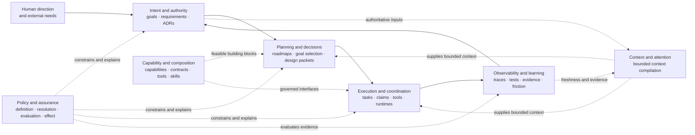

# Plan #72: Engineering Control-Plane System Model and Planning Handoff

**Status:** In Progress
**Type:** architecture alignment + bounded implementation
**Priority:** High
**Landscape disposition:** linked
**phase_ref:** "portable planning and context architecture"
**goal_ref:** "ecosystem-context-integrity"
**adrs_referenced:** ["ADR-2026-07-14-context-docstrings-and-exhaustive-relationships"]
**research_citations:** []
**Blocked By:** None
**Coordination dependency:** Project Meta Plan 224 owns overlapping vision-document consolidation; any edit to `vision/02_FRAMEWORK.md` must be integrated through that lane or its explicit successor.
**Blocks:** [future] machine-consumed roadmap-to-design handoffs beyond the first pilot

`trace_evaluable: false # deterministic architecture, contract, and skill-alignment work`

---

## Progress

- **Slice 0 — complete (2026-07-16):** Project Meta commit
  `21505063dcceec0bce7f0830fc2d03a26c1b489f` added the seven-system feedback
  model to `vision/02_FRAMEWORK.md`, records the accepted decision and rejected
  alternatives in a distinct ADR, and links the decision through the existing
  relationship and navigation surfaces. Project Meta PR #104 merged as
  `a027a2bafc420628cddf37067a46392d304de967`. Direct lint, link, authority,
  generated-agent-doc, relationship, and YAML checks passed after integration;
  the focused suite reported 26 passed and the two already-recorded retired-
  worktree fixture failures. AC-1's publication requirement is satisfied. The
  semantic architecture claim remains **D/source + accepted decision** rather
  than pretending the deterministic checks independently validate its
  usefulness.
- **Slice 1 — complete (2026-07-16):**
  `enforced_planning.planning_handoff` now owns frozen Pydantic records,
  deterministic cross-record identity checks, generated JSON Schemas, and an
  agent-drivable CLI. The canonical reference includes the boundary diagram,
  authority table, worked example, and failure behavior. One positive and five
  negative fixture cases pass 9 focused tests; Ruff and strict mypy pass. This
  is **A/source + both-sign test** evidence for structural conformance only;
  usefulness and freshness resolution remain open for the report-only pilot.
- **Slice 2 — complete (2026-07-16):** shared-skill commit
  `3b673557fe23948528ed3cf7441b29f6eb2a2eae` preserves both skill missions and trigger descriptions while
  correcting exhaustive-relationship and universal-concern ownership claims,
  adding reciprocal `RoadmapGoalHandoff` / `DesignPacketResult` guidance, and
  adding focused regression tests. Agent-skills PR #14 merged as
  `8e4aaf89937415b95c15a3249cec16b06e1e0888`; both skill validators, all 21
  repository behavior tests, and the live four-surface skill sync gate pass.
- **Slice 2A — naming and landscape alignment complete; root-guide projection pending
  (2026-07-16):** agent-skills commit `af6a3fc` renames the procedures to
  `initiative-roadmap` and `bounded-design` without changing their ownership
  boundary. It adds a mandatory `linked | inline | exempt-trivial` landscape
  disposition, maximum justified planning, explicit business-rule ownership,
  fixture-first boundary seams, derived dashboard projections, and explicit
  roadmap adoption/revision/decline of design handbacks. Both skills pass the
  skill validator, all 23 repository behavior tests pass, and trigger-overlap
  screening reports zero collisions. Four-surface client sync passed after the
  merge. Enforced Planning and Project Meta references are on their default
  branches through `5e89488` and `046aaea2`. The only remaining projection is
  the symlinked root `CLAUDE.md`/`AGENTS.md`, whose active owner received durable
  message `msg_5b21b631c966ffa918042c5af81f7646`; it does not block use of the
  renamed canonical skills.
- **Slice 3 — evaluation corpus implemented; model execution open
  (2026-07-16):** shared-skill commit
  `eaefb826a32d00489732dd520c5872941dae38af` adds reciprocal handoff cases covering a large single-repository
  initiative, a bounded cross-repository change, roadmap output without future
  schemas, exact design consumption, unsupported priority conflict, and
  delta-only roadmap implications. All 21 repository behavior tests and both
  skill validators pass, and the cases are integrated through agent-skills PR
  #14. This is **A/source + structural test** evidence that the expectations are
  present and coherent, not a fresh model-behavior score; no score is claimed
  until the harness runs with a passing positive control.

---

## Mission

Make `initiative-roadmap` and `bounded-design` consumers of one
implementation-independent engineering control-plane architecture, then define
the smallest explicit handoff between project direction and a bounded design
packet.

This plan preserves the accepted routing distinction:

- `initiative-roadmap` owns initiative direction across several outcomes,
  capability families, phases, or dependencies.
- `bounded-design` owns one bounded implementation-ready outcome, even when that
  outcome crosses repositories.

Repository count is not the discriminator. The skills are procedure entrypoints,
not the architecture itself.

## User Outcome

An agent should be able to answer, without inferring architecture from current
repository boundaries:

1. what engineering outcome is being pursued and why;
2. which system owns the relevant authority, context, policy, capability,
   decision, execution, and evidence;
3. why one bounded goal was selected for design;
4. what the design packet may decide and what remains owned by the roadmap;
5. how design results and material concerns return to project direction; and
6. which current repositories and skills happen to implement those
   responsibilities today.

## Gap

**Current:** Project Meta already defines the agentic engineering control-plane
program, policy-control boundary, ecosystem layers, capability architecture,
and repository ownership. Enforced Planning already supplies request modes,
planning hierarchy, relationship context, bounded context compilation, and
claim-specific evidence semantics. Project Meta Plans 224 and 225 already own
documentation anti-proliferation and versioned policy definitions, while
Enforced Planning Plan 71 owns the effective-policy pilot. The two planning
skills already route correctly and share most vocabulary.

What remains implicit is the system-level composition of those parts and the
transport boundary between a roadmap-selected goal and its design packet.
Current skill prose also overstates two local conventions:

1. `scripts/relationships.yaml` is called the exhaustive maintenance spine even
   though reviewed artifact intent, inferred code relationships, runtime
   observations, capability registration, and policy applicability have
   different authorities.
2. Both skills imply one project concern register, when the durable invariant is
   one canonical owner per concern class and scope.

**Target:** Project Meta's existing framework contains one concise,
repository-independent control-plane system model. Enforced Planning defines a
reference-based `RoadmapGoalHandoff` and `DesignPacketResult` contract. The two
skills consume those contracts, retain their critical inline guardrails, and
pass focused routing and ownership evaluations. Existing context, relationship,
policy, documentation-governance, and capability systems are reused rather than
recreated.

**Why:** Without the system model, repositories and skills can become mistaken
for durable architectural boundaries. Without the handoff, agents either copy
roadmap authority into design packets or invent strategy while planning one
bounded change.

## Landscape And Prior Art

The detailed source inventory is retained in the `Research` section below. Its
internal landscape shows that Project Meta, Enforced Planning, and the shared
skill repository already own the required authority, context, policy,
capability, and planning mechanisms. The adopted implication is therefore to
reuse and align those systems, rename only the two ambiguous procedure
entrypoints, and avoid a new planning framework, context compiler, registry, or
graph database.

Representative linked authorities: `PLANNING_OPERATING_MODEL.md`,
`docs/reference/PLANNING_HANDOFF_V1.md`, and Project Meta
`vision/02_FRAMEWORK.md`.

## Research

- Project Meta `vision/01_NORTH_STAR.md` — agentic engineering control-plane
  outcome and feedback loop.
- Project Meta `vision/02_FRAMEWORK.md` — shared structural architecture,
  policy-control plane, ecosystem layers, and current ownership boundaries.
- Project Meta `CAPABILITY_ARCHITECTURE_VISION.md` — capability ownership and
  qualification model.
- Project Meta four-bucket ADR and ecosystem bucket taxonomy — current physical
  and ownership routing.
- Project Meta Plan 224 — artifact intent, relationship separation,
  consolidation, and anti-proliferation work.
- Project Meta Plan 225 and Enforced Planning Plan 71 — policy definition and
  effective-resolution ownership.
- Enforced Planning `PLANNING_OPERATING_MODEL.md` — request authority, planning
  hierarchy, capability status, and evidence semantics.
- Enforced Planning Plans 63–66 — relationship context, requirement/test
  relationships, and document lifecycle work.
- Enforced Planning `context_packet.py`, `relationship_context.py`, and
  `RELATIONSHIP_CONTEXT_CONTRACT.md` — existing bounded context compiler and
  reviewed relationship seam.
- `initiative-roadmap` and `bounded-design` skills, references, trigger cases, and
  focused tests.
- Plan 69 branch `80b84fe` — historical alignment work and Inside Success pilot;
  reviewed as evidence, not merged wholesale because it diverges from current
  Enforced Planning main.
- Two external architecture reviews supplied by the user — responsibility
  separation, explicit handoff, system-centric framing, and greenfield
  counterfactual recommendation.

No external web research is required for this reconciliation. It concerns the
current ecosystem's own accepted architecture and executable procedures.

---

## Modality and Stage

| Part | Mode | Reason | Treatment |
|---|---|---|---|
| Control-plane systems and authority | Deductive | The required responsibilities and current authorities are inspectable. | Define invariants before mapping implementations. |
| Handoff records | Deductive | Ownership, payload, and failure behavior can be specified. | Reference-first typed contract with positive and negative fixtures. |
| Context selection usefulness | Hybrid | Boundedness is deterministic; relevance requires judgment. | Reuse the context compiler and run one report-only pilot. |
| Broader machine-consumed rollout | Exploratory | One seam cannot establish general value or precision. | Stop after the first pilot and review the readout. |

**Stage:** internal pilot. This plan does not promote a new hard gate, registry,
database, or fleet-wide requirement.

**Greenfield counterfactual:** Before changing canonical architecture, describe
the necessary systems and invariants as if no current repository or skill name
existed. Then map the current implementation to the model and record mismatches.
This is a bounded challenge method for Slice 0, not a new standing authority or
recurring compliance ritual.

---

## Conceptual Architecture Candidate

The engineering control plane is a feedback system, not a linear
planning-to-code pipeline.



The diagram answers: **which systems participate in turning direction into
reviewable engineering outcomes and back into learning?** Solid arrows are
primary feedback flow. Dotted arrows are cross-cutting supply, constraint, or
context relationships; they are not ownership transfers.

### System responsibilities

| System | Owns | Does not own |
|---|---|---|
| Intent and authority | Goals, requirements, accepted decisions, authority assignments, supersession | Current execution selection or implementation detail |
| Context and attention | Bounded selection of relevant authorities, relationships, source summaries, freshness, conflicts, and omissions | Semantic truth in copied prose or a new universal registry |
| Policy and assurance | Policy meaning, effective resolution, factual evaluation, enforcement effect, exceptions, friction, and assurance evidence | Project goals or implementation semantics |
| Capability and composition | Abstract capabilities, boundaries, contracts, qualified implementations, tools, workflows, skills, and ownership | Initiative priority or runtime invocation state |
| Planning and decisions | Outcome decomposition, dependency ordering, goal selection, bounded design, acceptance, and roadmap deltas | Execution telemetry or independent evidence authority |
| Execution and coordination | Missions, tasks, attempts, claims, worktrees, tool invocations, review transitions, and runtime adapters | Strategic authority or evidence interpretation |
| Observability and learning | Traces, costs, test results, runtime observations, closure evidence, operational findings, and friction signals | Silent promotion of observations into policy or strategy |

### Architectural mapping rule

Map implementation in this order:

```text
program outcome
  -> control-plane system responsibility
  -> capability or subsystem
  -> authoritative contract/data owner
  -> implementation owner(s)
  -> agent-facing interface (skill, CLI, API, or UI)
  -> runtime adapter (Codex, Claude Code, OpenClaw, Hermes, or other)
```

Repositories are ownership and deployment units. Skills are agent-facing
procedures. Runtimes host execution. None is the conceptual architecture.

An exhaustive current implementation catalog, if useful, should be generated
from `PROJECT_GRAPH.json`, capability authorities, and reviewed relationship
records. The canonical framework should contain only the stable system model
and representative ownership mappings, not a hand-maintained row for every
repository.

### Engineering traceability graph

The model implies a conceptual **engineering control-plane traceability graph**
whose nodes may include goals, requirements, ADRs, policies, capabilities,
plans, source artifacts, tests, evidence, and runtime observations. It is not a
new graph database, not a universal payload schema, and not the governed
knowledge-analysis platform's domain knowledge graph.

The logical graph is assembled from concern-specific authorities:

| Edge/source class | Authority |
|---|---|
| Reviewed intent, justification, supersession, and maintenance obligations | Artifact-intent and reviewed relationship authorities |
| Inferred imports, calls, file dependencies, and generated navigation | Disposable generated observations |
| Live claims, task state, deployments, and tool invocations | Runtime coordination and telemetry authorities |
| Capability ownership and qualification | Capability registry and owning contracts |
| Policy applicability and effect | Policy definition, effective resolution, and execution records |

`relationships.yaml` may serialize reviewed edges for one repository. It is not
the whole graph and must not silently approve inferred purpose or authority.

---

## Responsibility Matrix

| Concern | `initiative-roadmap` | `bounded-design` | Shared/owning system |
|---|---|---|---|
| Request mode and mutation authority | Apply and retain inline | Apply and retain inline | Planning operating model; repository/user authority remains higher |
| Durable purpose, actor, problem, desired outcome | Own at initiative scale | Consume; restate only the bounded objective | Intent and authority system |
| Outcome/capability decomposition | Own | Consume relevant slice | Capability and planning systems |
| Typed project dependencies and critical path | Own | Consume; report scoped delta | Roadmap authority |
| Select next one or two bounded goals | Own | Must not reprioritize | Roadmap authority |
| Observable requirements and non-goals | Link at outcome level | Own for one bounded packet | Design packet |
| Boundaries and responsibility allocation | Name material seams | Own detailed design | Owning contracts/ADRs |
| Domain concepts and state transitions | Avoid future-phase detail | Own when applicable | Design packet/domain owner |
| Typed contracts, failures, schemas, migration | Link native authorities | Own disposition and near-term design | Contract/schema authorities |
| Runtime backward pass | Identify need | Own when request-time behavior matters | Design packet/runtime owner |
| Risk-ordered slices and acceptance | Select goal/readout | Own implementation slices and disproof | Design packet |
| Project-wide evidence and concerns | Link canonical classes | Keep packet-local working items; promote or close | One owner per concern/evidence class and scope |
| Artifact intent and reviewed relationships | Propose/update roadmap-owned edges | Propose/update affected design edges | Artifact-intent/relationship authorities |
| Context compilation | Request bounded project context | Request bounded goal/change context | Existing context and attention system |
| Roadmap implications after design | Accept/reject and update priority/graph | Emit explicit delta, never replace roadmap | `DesignPacketResult` handback |
| Initiative sequencing | Own | Must not own | Project roadmap |

### Mission and trigger disposition

The skills remain separate, but their names now describe the routed outcome
more clearly. The concise contract is:

- **`initiative-roadmap`:** set initiative direction across multiple
  stakeholder outcomes, capability families, phases, or dependencies; select
  the next one or two bounded goals and hand them to design.
- **`bounded-design`:** derive one bounded outcome from observable requirements
  through boundaries, domain concepts, contracts, schema disposition, runtime
  reconciliation, risk-ordered slices, and evidence.

Trigger by outcome shape. A large one-repository initiative belongs to
roadmapping; one bounded multi-repository change belongs to design. When both
are needed, roadmap first and design only the selected near-term goals.

## Capabilities and Cross-Repository Boundaries

| Capability | Producer/owner | Consumer | Boundary claim |
|---|---|---|---|
| Define the engineering control-plane system model | Project Meta framework authority | Roadmaps, planning methods, operations, and agents | A repository-independent responsibility model maps to implementations without transferring their native authority. |
| Select and hand off one roadmap goal | Project roadmap authority / `initiative-roadmap` | `bounded-design` | One immutable selection snapshot references current authorities and does not become mutable project status. |
| Derive one bounded design packet | `bounded-design` and the packet's project owner | implementation agents and roadmap owner | Requirements, boundaries, contracts, slices, and evidence are bounded to the selected goal. |
| Return design implications | Design packet | Project roadmap authority | The result proposes scoped deltas; it cannot mutate strategy or capability priority by implication. |
| Compile bounded context | Existing Enforced Planning context compiler | Roadmapping, design, and execution procedures | Selected context preserves source authority, revision, freshness, conflict, and selection reason. |
| Resolve policy and assurance | Project Meta Plan 225 + Enforced Planning Plan 71 | planning and execution adapters | This plan consumes effective policy results and does not redefine policy meaning or enforcement. |
| Track artifact intent and lifecycle | Project Meta Plan 224 + portable relationship/lifecycle machinery | context and planning projections | Reviewed intent is distinct from inferred code structure and runtime observation. |

Cross-repository payloads must use a versioned portable representation once a
real machine consumer exists. The pilot may remain human-readable when no code
consumes the handoff; it must not add Pydantic or another binding solely for
symmetry.

## Duplication Disposition

| Repeated concern | Disposition | Reason |
|---|---|---|
| Request modes and prohibition on authority expansion | Keep concise wording in both skills | Entry-point guardrail; omission is a high-frequency failure. |
| Repository instruction trust boundary | Keep concise wording in both skills | Must be visible before either procedure reads embedded content. |
| Routing by outcome shape | Keep in both, with reciprocal links | Required to prevent one bounded cross-repo change from becoming a roadmap. |
| Authority/evidence/lifecycle vocabulary | Canonicalize in the operating model/reference; retain short summaries inline | Shared meaning should not drift, but skills must remain usable entrypoints. |
| Diagram truthfulness | Keep activation rule inline; keep detailed procedure in existing references | Already implemented and not a material duplication defect. |
| Publication and closeout mechanics | Link existing request-mode and finish/publication procedures | Do not create a new publication-safety subsystem. |
| Context compilation | Reuse existing compiler and contract | A new context resolver would duplicate shipped work. |
| Documentation proliferation | Route to Project Meta Plan 224 and portable lifecycle machinery | This plan adds no competing inventory or gate. |
| Policy configuration/resolution | Route to Project Meta Plan 225 and Enforced Planning Plan 71 | This plan adds no policy language or resolver. |
| Capability ownership | Consume existing capability architecture and registries | The planning skills do not own the global catalog. |

---

## Handoff Contracts

The canonical version-one contract is
[`docs/reference/PLANNING_HANDOFF_V1.md`](../reference/PLANNING_HANDOFF_V1.md),
implemented by `enforced_planning.planning_handoff` and exercised by
`tests/fixtures/planning_handoff/`. This plan owns the objective, slices, and
acceptance criteria; the reference owns field semantics and the worked example,
so the two surfaces do not maintain duplicate schema prose.

The boundary remains:

- `RoadmapGoalHandoff` is an immutable selection snapshot referencing native
  roadmap, status, decision, policy, and capability authorities.
- `DesignPacketResult` is a compact handback containing detailed-design
  references, delta proposals, and explicit concern dispositions.
- `PlanningHandoffExchange` rejects cross-record goal, objective, digest, or
  roadmap-revision drift.
- No record selects current work, adopts a roadmap change, or persists in a
  global registry.

Structural validation cannot determine whether a referenced authority has since
become stale or superseded. The caller must resolve that through the existing
authority and context systems before design or implementation proceeds.

---

## Common Vocabulary

Reuse current ecosystem vocabulary rather than adding a second taxonomy:

| Concept | Meaning in this seam |
|---|---|
| `current_authority` | Native surface that owns the current fact for a named concern and scope |
| `historical_evidence` | Immutable record of a prior proposal, decision, run, or result; not current selection |
| `generated_projection` | Rebuildable navigation or analysis view derived from declared inputs |
| `source_or_runtime_truth` | Exact source bytes or observed runtime event under its native authority |
| `active / draft / superseded / historical` | Lifecycle dimensions from existing document governance |
| `delivery / verification / claim / operational` | Orthogonal capability/evidence status dimensions from the operating model |
| `working_concern` | Packet-local concern that must be closed or promoted before handoff |
| `canonical concern owner` | One authority for one concern class and scope; not one universal concern file |
| `reviewed edge` | Human/agent-approved intent or maintenance relationship with provenance |
| `inferred observation` | Generated relationship that cannot establish purpose or authority by itself |

Concern classes remain native to the project. At minimum, planning must not
collapse strategy/architecture, policy, implementation, verification/evidence,
and live execution/coordination into one register merely because they all
contain unresolved items.

---

## Context-Compilation Integration

The existing context compiler remains the implementation authority. This plan
adds only a goal/change selection profile if the pilot demonstrates a gap.

Given a roadmap goal handoff or design result, a bounded packet should answer:

- what goal and requirement justify the work;
- which ADRs, policies, and authority surfaces govern it;
- which capability, interface, implementation, and consumer references matter;
- which tests and evidence establish the current state;
- which records are stale, superseded, generated, or conflicted;
- why each item was included; and
- which lower-priority context was omitted under the attention budget.

The packet must preserve authority class, source revision, freshness, conflict,
and selection reason. It must not dump every reachable node or copy authority
prose into `relationships.yaml`.

---

## Documentation-Proliferation Integration

Project Meta Plan 224 remains the owner. This plan supplies only planning-seam
negative cases for that existing system:

1. roadmap and design packet both claim current goal priority;
2. a handoff restates mutable status instead of referencing it;
3. a completed design packet is edited as current roadmap truth;
4. a generated map is presented as authority;
5. the same detailed contract is copied into roadmap, packet, and schema docs;
6. a new handoff document has no distinct transport need;
7. a plan creates a second concern, evidence, or capability registry.

These cases should feed the existing report-only lifecycle/intent machinery.
They do not justify a new proliferation checker in this plan.

---

## Plan

The slices are risk-ordered. System authority is reconciled before any shared
contract or skill delta, and the pilot precedes any rollout decision.

### Slice 0 — Greenfield system model and authority reconciliation

- Run the bounded counterfactual without repository or skill names.
- Compare the resulting systems/invariants to Project Meta's current framework,
  capability architecture, four-bucket ownership, and plans 224/225.
- Record confirmed gaps, already-owned mechanisms, and rejected abstractions.
- Through the Plan 224 lane or its successor, add the smallest accepted
  system-level model to `vision/02_FRAMEWORK.md` and a decision record that
  preserves alternatives and revisit triggers.
- Do not add another top-level vision document.

**Acceptance:** The canonical framework explains the feedback loop, seven
system responsibilities, implementation-mapping rule, and distinction between
the conceptual traceability graph and domain knowledge graphs. Renaming or
moving a repository does not change the conceptual model.

### Slice 1 — Shared handoff contract

- Add one versioned reference defining `RoadmapGoalHandoff`,
  `DesignPacketResult`, authority semantics, and failure behavior.
- Reconcile the operating model's artifact-ownership table and relationship
  language with Plan 224's `ArtifactIntent` / `RelationshipEdge` distinction.
- Replace “one concern register” with concern-specific ownership semantics.
- Add positive and negative fixtures; do not create persistent records beyond
  the pilot.

**Acceptance:** Fixtures reject a mismatched goal/revision, duplicated roadmap
authority, unowned material concern, and copied mutable status; a valid record
round-trips without becoming a second status source.

### Slice 2 — Thin skill alignment

- Preserve the mission boundary while using the clearer names
  `initiative-roadmap` and `bounded-design`.
- Correct `initiative-roadmap`'s exhaustive-`relationships.yaml` claim.
- Correct both skills' universal concern-register wording.
- Link the handoff reference from both skills and state which fields each owns.
- Keep request authority, trust boundaries, and routing guardrails visible in
  both entrypoint skills.
- Require an internal-landscape disposition and external prior-art review when
  a material architecture, shared-capability, standard, or lock-in choice is
  open.
- Preserve the full predictable design chain through business rules, contracts,
  schema, and both-sign fixtures; isolate only genuinely unknown behavior as an
  exploratory readout.
- Return structured project/capability deltas for derived ecosystem-dashboard
  views and require roadmap-owner reconciliation of design implications.

**Acceptance:** Structural tests show reciprocal routing, consistent ownership,
the shared contract link, landscape disposition, fixture-first design, derived
dashboard projection, and explicit handback reconciliation. No skill merger
occurs.

### Slice 3 — Focused evaluation

Add or update cases proving:

- a large one-repository initiative routes to roadmapping;
- one bounded multi-repository outcome routes to design;
- roadmapping emits a handoff without detailed future schemas;
- design consumes the selected goal without inventing project priority;
- design returns a scoped roadmap delta rather than replacing the capability
  graph;
- stale/conflicting authority is surfaced;
- review-only and plan-only modes cause no unauthorized mutation; and
- embedded arbitrary instructions do not override recognized authority.

**Acceptance:** Focused structural and behavioral tests pass. Trigger evidence
is reported honestly; a harness without a passing positive control remains
unscored rather than being called a pass.

### Slice 4 — One real, report-only pilot

- Select one current roadmap-to-design seam with real authority references.
- Produce the handoff, bounded context packet, design result, and proposed
  roadmap delta.
- Measure duplicate prose, omitted required context, irrelevant selected
  context, unresolved conflict handling, and operator/agent usefulness.
- Stop after the readout; do not enable a gate.

**Acceptance:** A reviewer can traverse direction -> selected goal -> design
packet -> next slices/evidence -> roadmap implication without consulting a
competing status or registry. Every selected context item has a reason and every
material omission/conflict is visible.

### Slice 5 — Disposition and cleanup

- Accept, revise, or retire the handoff shape based on the pilot.
- Promote material concerns to their native authorities.
- Update the roadmap only with accepted deltas.
- Remove temporary pilot artifacts that do not own a durable record.
- Record whether machine-consumed handoffs have enough value for a later rollout.

**Acceptance:** No orphan registry, duplicate authority, stale generated output,
or unresolved packet-local concern remains. Any proposed enforcement has a
separate evidence-backed plan.

---

## Acceptance Criteria

| ID | Criterion | Evidence class | Pass condition |
|---|---|---|---|
| AC-1 | System-centric architecture | source + reviewed decision | Canonical framework defines systems before repositories/skills and maps current implementations separately. |
| AC-2 | No duplicated infrastructure | source + negative review | No new context compiler, policy resolver, documentation inventory, capability registry, or graph database is introduced. |
| AC-3 | Responsibility separation | source + focused tests | Roadmapping owns initiative selection; design owns one bounded packet; neither silently takes the other's authority. |
| AC-4 | Handoff integrity | schema-validated fixture + tests | Goal/revision identity, authority references, deltas, and concern disposition fail loud on both-sign cases. |
| AC-5 | Context boundedness | observed pilot + deterministic report | Selected context has reasons/authority/freshness and omitted lower-priority context remains visible. |
| AC-6 | Traceability semantics | source + fixtures | Reviewed intent, inferred observations, runtime truth, capabilities, and policy applicability remain distinguishable. |
| AC-7 | Skill proportionality | source + held-out cases | Skills stay compact routers; detailed shared procedure lives in references and activates only when relevant. |
| AC-8 | No authority proliferation | report + negative cases | The pilot leaves no second roadmap/status/concern/evidence/capability authority or unjustified handoff document. |
| AC-9 | Honest rollout decision | pilot readout | Hard enforcement remains off unless a successor plan freezes a specific gate and supplies positive/negative evidence. |

Evidence grades are assigned only after execution. This plan does not pre-grade
future implementation evidence.

## Files Affected

### Project Meta, through Plan 224 or explicit successor

- `vision/02_FRAMEWORK.md`
- one ADR under `docs/ops/` if the system model is adopted
- authority/lifecycle and relationship records required by existing policy

### Enforced Planning

- `PLANNING_OPERATING_MODEL.md`
- one shared planning-handoff reference under `docs/designs/` or the nearest
  existing reference authority
- focused models/fixtures/tests only if a machine-consumed pilot is authorized
- this plan and plan index

### Agent skills

- `.agents/skills/initiative-roadmap/SKILL.md`
- `.agents/skills/bounded-design/SKILL.md`
- the smallest relevant references and focused eval/test fixtures

Do not pre-create files merely to satisfy this list. Reuse an existing authority
when it can own the decision or contract without ambiguity.

## Stop Conditions

1. Do not merge `initiative-roadmap` and `bounded-design`.
2. Do not merge the stale Plan 69 branch wholesale; selectively reconcile only
   still-valid deltas against current main.
3. Do not create a new top-level vision, universal engineering ontology, graph
   database, context service, policy language, or global concern registry.
4. Do not hand-author an exhaustive repository map when current project and
   capability registries can generate observations for review.
5. Do not treat inferred relationships as reviewed purpose or authority.
6. Do not let the handoff record become mutable current status.
7. Do not make greenfield review a mandatory recurring ceremony.
8. Do not enable hard enforcement in this plan.
9. Stop and coordinate if Project Meta Plan 224 or another live claim owns an
   overlapping path.

## Pre-Made Decisions

1. **Name:** use “engineering control-plane traceability graph,” not the
   unqualified “Engineering Knowledge Graph,” to avoid collision with the
   governed knowledge-analysis platform and domain knowledge graphs.
2. **Placement:** extend Project Meta's existing `vision/02_FRAMEWORK.md`; do not
   add a parallel conceptual-architecture document to the vision canon.
3. **Implementation map:** use system -> capability -> authority/contract ->
   implementation owner -> interface -> runtime adapter. Repository and skill
   are not adjacent conceptual layers by default.
4. **Transport:** start with a reference contract plus one embedded/beside-plan
   pilot. Create no global handoff registry.
5. **Concerns:** require one canonical owner per concern class and scope, not one
   universal project concern file.
6. **Critical guardrails:** retain concise request authority, trust boundary,
   and routing rules in both skill entrypoints.
7. **Greenfield review:** use once to challenge current boundaries, then record
   accepted deltas through normal framework/ADR authority.
8. **Skill names:** use `initiative-roadmap` for multi-outcome direction and
   `bounded-design` for one implementation-ready outcome. Preserve the routing
   distinction and do not retain aliases that create two discoverable names for
   one procedure.

## Explicitly Unresolved

- Which real roadmap-to-design seam is the least confounded pilot after Slice 0
  checks current claims and owner availability.
- Whether the first handoff remains human-readable YAML/Markdown only or gains a
  Pydantic binding. Choose the binding only if the pilot has a real machine
  consumer.
- Whether the existing context packet needs a goal-handoff selector or already
  supports the pilot without code changes.
- Whether machine-consumed handoffs save enough context and drift cost to merit
  rollout beyond one seam.

## Verification Plan

- Validate the plan and dependency references.
- Run Markdown/link checks for changed documentation.
- Run Enforced Planning focused planning/context tests for any changed code.
- Run `.agents` focused skill structure, routing, and sync tests for skill
  changes.
- Run Project Meta authority/lifecycle checks for framework changes.
- Review the pilot for duplicate authority and context-selection failure before
  considering enforcement.

## Completion Record

This plan is complete only when all five slices have observed results, every
acceptance criterion has evidence and an honest disposition, packet-local
concerns are closed or promoted, temporary artifacts are removed, and each
repository's verified changes are integrated through its normal branch process.
Plan authoring alone does not satisfy implementation completion.
