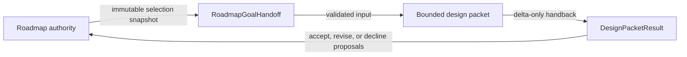

# Planning Handoff Contract v1

**Status:** Pilot contract
**Owner:** Enforced Planning
**Scope:** Transport between `project-roadmapping` and one `design-plan` packet
**Non-authority:** This contract does not select current work, own roadmap
priority, or store handoff state.

## Purpose

Use this contract only when a roadmap-selected goal crosses into a distinct
bounded design procedure. It preserves the roadmap's authority while giving
design an exact objective, governing references, dependencies, unknowns, and
evidence target. The return record contains proposals and concern dispositions;
the roadmap owner must adopt any roadmap change in the roadmap's own authority.



Arrows mean transport or review, not authority transfer. No record is written
to a global handoff registry.

## Derivation

| Design step | Decision |
|---|---|
| Requirement | Preserve goal identity, selected revision, acceptance, governing references, and material unknowns across the procedure boundary. |
| Boundary | Roadmapping owns selection and project direction; design owns detailed requirements, boundaries, contracts, schema disposition, and slices. |
| Domain model | `RoadmapGoalHandoff`, `DesignPacketResult`, concern dispositions, authority references, and typed delta proposals. |
| Contract | Immutable input plus delta-only result; cross-record identity and revision checks fail loud. |
| Schema | Frozen Pydantic records in `enforced_planning.planning_handoff`; JSON Schema is generated from those models. |

## Authority Allocation

| Fact | Authority |
|---|---|
| Which goal is selected and why | Project roadmap or its native goal-selection authority |
| Current implementation or evidence state | Referenced current-state/evidence authority |
| Detailed bounded design | Design packet |
| Proposed capability, relationship, or roadmap delta | `DesignPacketResult` until accepted; then the native owner |
| Current execution lane | Existing execution-selection authority, never either handoff record |

## Records

`RoadmapGoalHandoff` binds its deterministic ID to `project_id`, `goal_id`, and
the immutable roadmap revision. It also binds the exact objective text by
SHA-256. References carry a path, immutable revision, and named concern instead
of copying source prose.

`DesignPacketResult` echoes the goal, objective, roadmap revision, and canonical
handoff digest. Its capability, relationship, and roadmap fields are typed
proposals. A material concern must be:

- `closed`, with a resolution;
- `promoted`, with its concern-specific authority; or
- `assigned`, with an owner role and exact resume condition.

The `PlanningHandoffExchange` validator proves the two records belong together.
It does not prove that the design is correct or useful.

## Worked Example

The positive fixture at
`tests/fixtures/planning_handoff/valid_exchange.yaml` selects Plan 72's bounded
contract outcome against an immutable roadmap revision. The result preserves
that objective, closes the risk of accidental registry creation, and proposes a
report-only pilot. The proposal is not adopted roadmap state.

The compact negative-case fixture mutates that valid exchange to demonstrate
five failures: mismatched goal, mismatched roadmap revision, duplicated roadmap
authority, copied mutable status, and an assigned concern without an owner.

## Agent and CLI Use

Validate an exchange:

```bash
python -m enforced_planning.planning_handoff validate \
  tests/fixtures/planning_handoff/valid_exchange.yaml
```

Inspect generated schemas:

```bash
python -m enforced_planning.planning_handoff schema handoff
python -m enforced_planning.planning_handoff schema result
python -m enforced_planning.planning_handoff schema exchange
```

The validator exits nonzero and prints a structured error on invalid input. It
does not write files, register current state, or adopt returned proposals.

## Failure Behavior

| Failure | Result |
|---|---|
| Unknown or mismatched goal, objective, handoff digest, or roadmap revision | Reject the exchange. |
| Missing immutable revision | Reject the record. |
| Undeclared priority, status, or roadmap-authority field | Reject the extra field. |
| Material concern without closure, native authority, or owner/resume condition | Reject the result. |
| Proposed objective revision | Permit the proposal, but do not authorize implementation until the roadmap authority adopts it. |
| Superseded or stale referenced authority | The caller must surface and resolve it; structural validation alone cannot establish freshness. |

## Compatibility and Promotion

Version `1.0` is a pilot contract. Additive or breaking field changes require a
new schema version and fixtures. Broader adoption requires one real report-only
pilot showing that the handoff reduces omitted context or duplicated authority.
Structural conformance alone does not justify a mandatory gate or persistent
handoff store.
